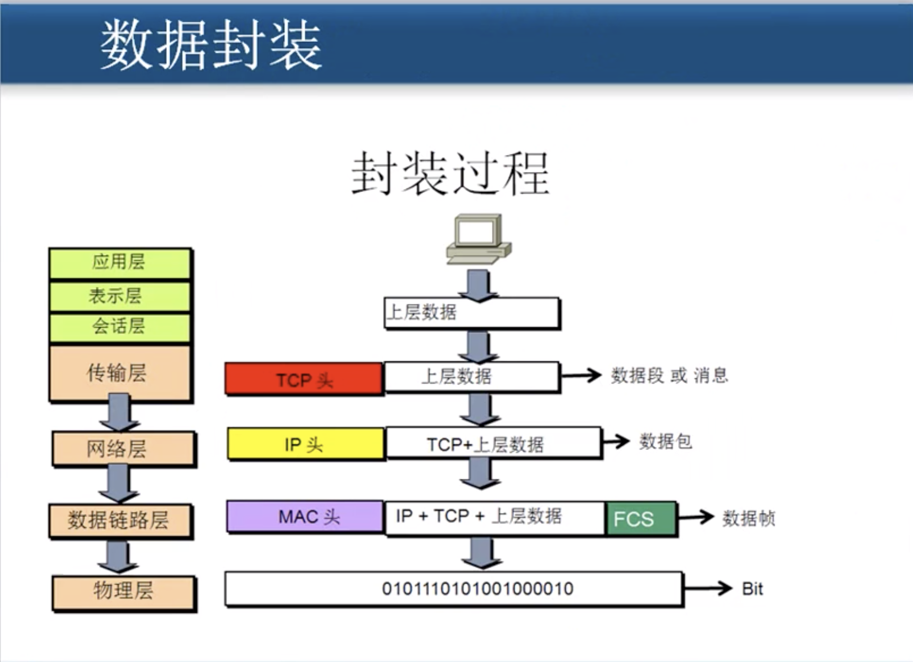

# 1.2 数据包,数据帧

## 数据包中的IP地址是不会被更改的.

### MAC地址: 物理地址

1. 传输过程中MAC地址会被经常修改\(路由器改的\)

## 封装数据

#### 封装过程

1. 上层数据 : 由应用层 ,表示层, 会话层 封装这个数据.
2. 数据段:  由传输层, 在上层数据的基础上添加了 _**TCP头\(或者UDP\).**_
3. 数据包:  由网络层, 在_**数据段**_的基础上添加了 _**IP地址**_.
4. 数据帧:  由数据链路层, 添加了_**MAC地址**_ 和 _**FCS验证码**_.
5. bit:    由物理层发送数据.

数据帧内的IP和端口都是_**大端表示法**_.\(高对低, 低对高\)

1.  0xF  \(大端  0000  1111 \)   0是低地址位 - 网络需要大端
2.  0xF \(小端   1111 0000  \)   1是低地址位  - 目前设备都是小端

