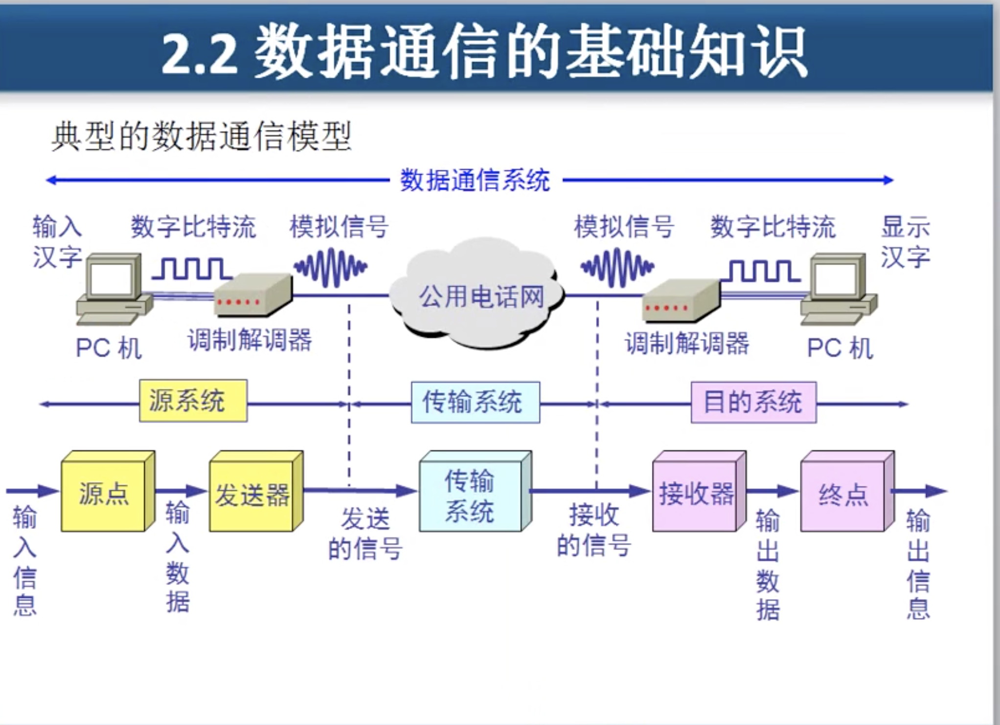
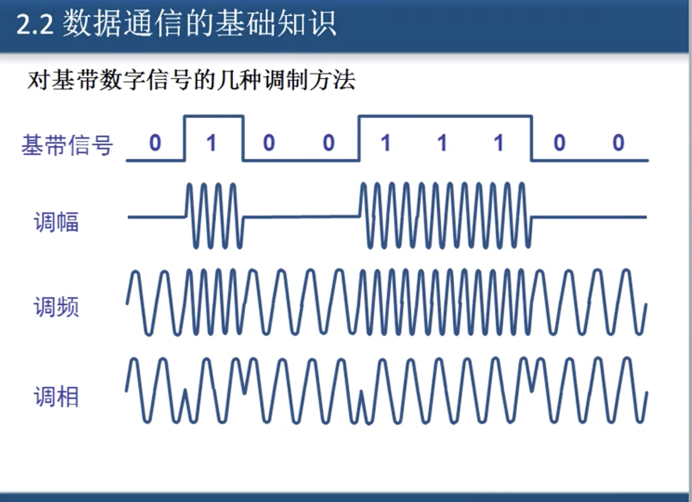
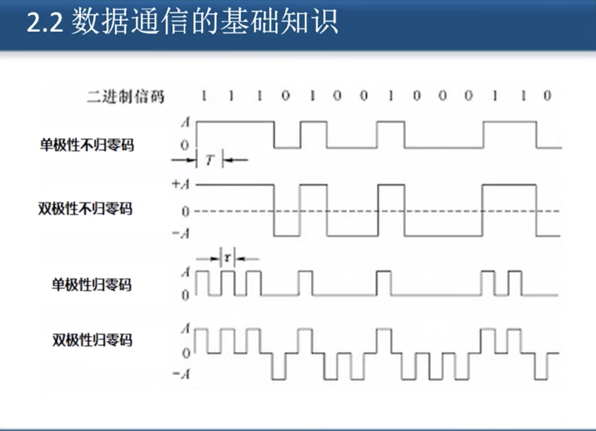
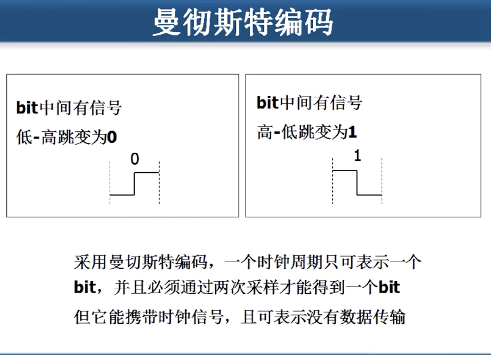
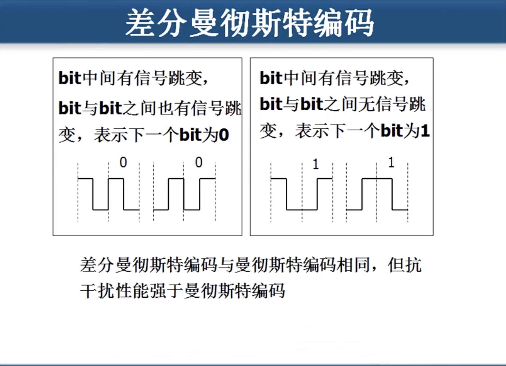
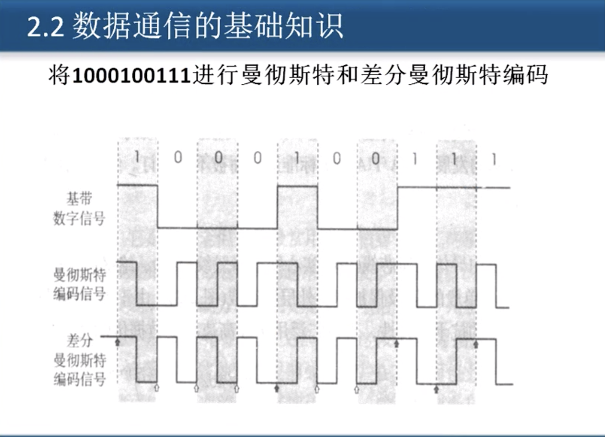
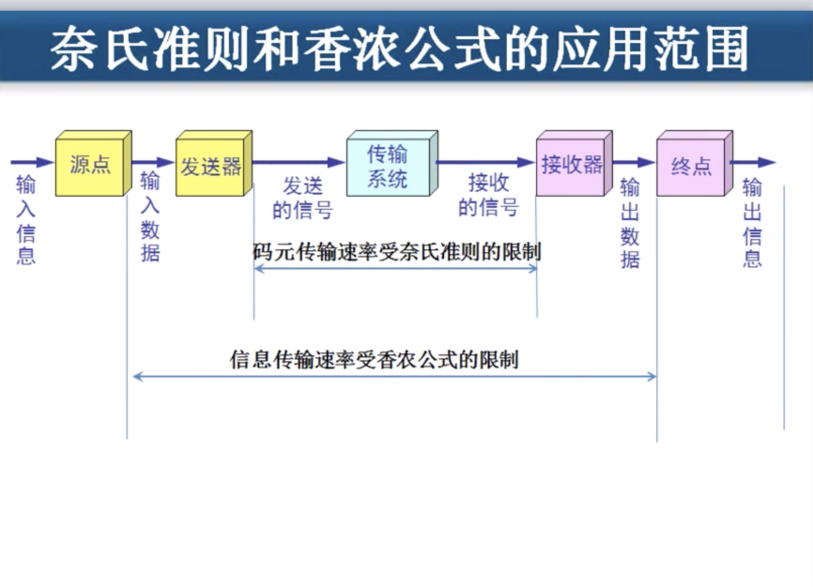

# 2.2 数据通信的基础知识

## 1. 典型的数据通信模型

## 2. 相关术语

* **通信的目的是传送消息**
* **数据\(data\) -- 运送消息的实体**
* **信号\(signal\) -- 数据的电气 或 电磁 的表现**
  * 模拟信号 -- 代表消息的参数的取值是连续的
  * 数字信号 -- 代表消息的参数的取值是离散
* **码元\(code\) -- 在使用时间域的波形表示数字信号时, 则代表不同离散数值的基本波形 就成了码元**
* **在数字通信中常常用时间间隔相同的符号来表示一个二进制数字, 这样的时间间隔内的信号称为二进制码元. 而这个间隔被称为码元长度. 1码元可以携带 nbit的信息量**

## 3. 有关信道的基本概念

#### 信道一般表示一个方向传送信息的媒体.  所以 咱们说平常的通信线路往往包含一条发送信息的信道和一条接受信息的信道.

* **单向通信\(单工通信\)** -- 只能有一个方向的通信,而没有反方向的交互. _**例如电视机和电视塔**_
* **双向交替通信\(半双工通信\)** -- 通信的双方都能发送和接受信息,但是不能双方同时发送和接受信息.
* **双向同时通信\(全双工通信\)** -- 通信的双方可以同时发送和接受信息.

## 4.  基带\(base band\)信号和带通\(band pass\)信号

* **基带信号\(即基本频带信号\)  --**  _**来自信号源的信号**_**,  像计算机输出的代表各种文字或图像文件的数据信号都属于基带信号. 基带信号就是发出的直接表达了要传输的信息的信号, 比如我们说话的声波就是基带信号.**
* **带通信号   --   把基带信号进过载波调制后, 把信号的频率范围搬移到更高的频段, 以便在信道中传输\(** _**即仅在一段频率范围能能够通过信道\)**_**.**

#### 因此在传输距离较近时, 计算机网络都采用 "**基带传输" 方式用于在近距离范围内基带信号的衰减不大, 从而信号内容不会发生变化, 从而信号的内容也不会发生变化.   如从计算机到显示器, 打印机等外设的信号 就是从基带传输的.**

_**带通信号比基带信号传的更远**_

###  4.1 几种最基本的调制方法

* **调幅\(AM\)**
* **调频\(FM\)**
* **调相\(PM\)**

## 5. 常用编码

* 单极性不归零码
* 双极性不归零码
* 单极性归零码
* 双极性归零码
* 曼切斯特编码
* 差分曼砌斯特编码

## 6. 准则和公式

#### 信道的极限容量

**奈氏准则   没有信号干扰, 码元的传输速率有上限.**

**香农公式   有信号干扰 , 无差错传输速率.** 

$$
C = W * log2(1+S/N)   ;  b/s
$$

### 

