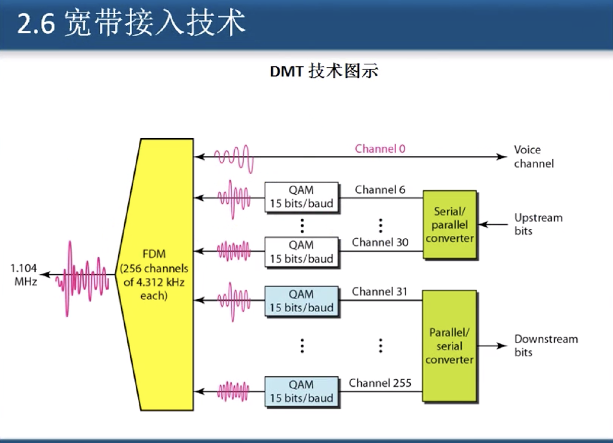
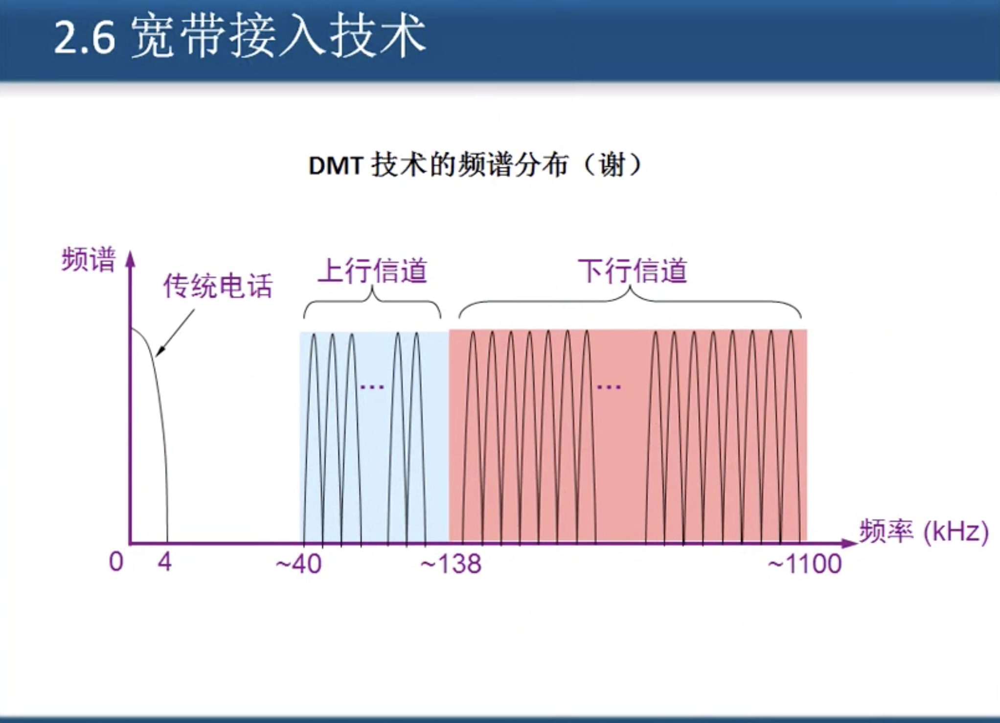
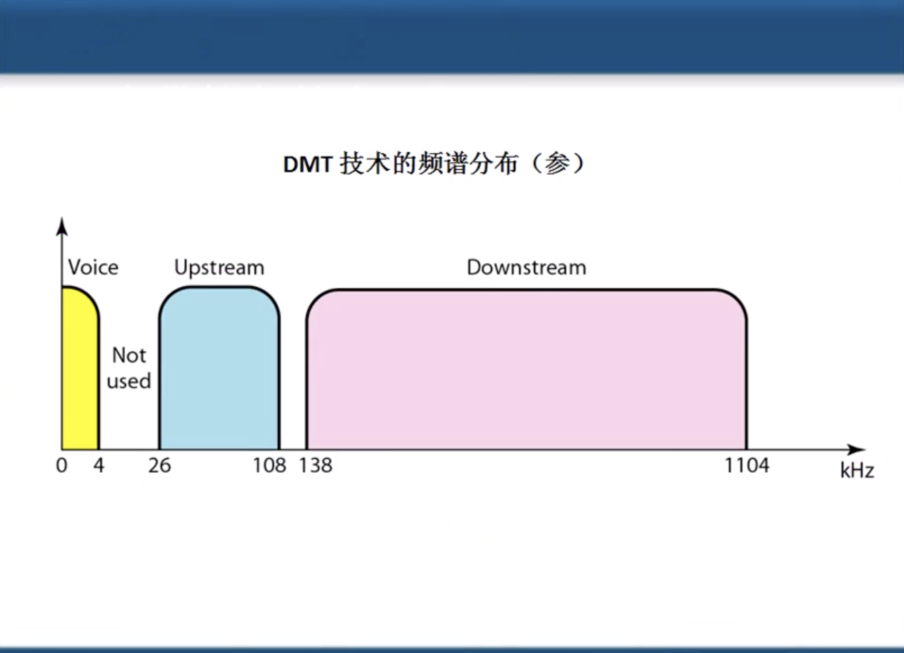
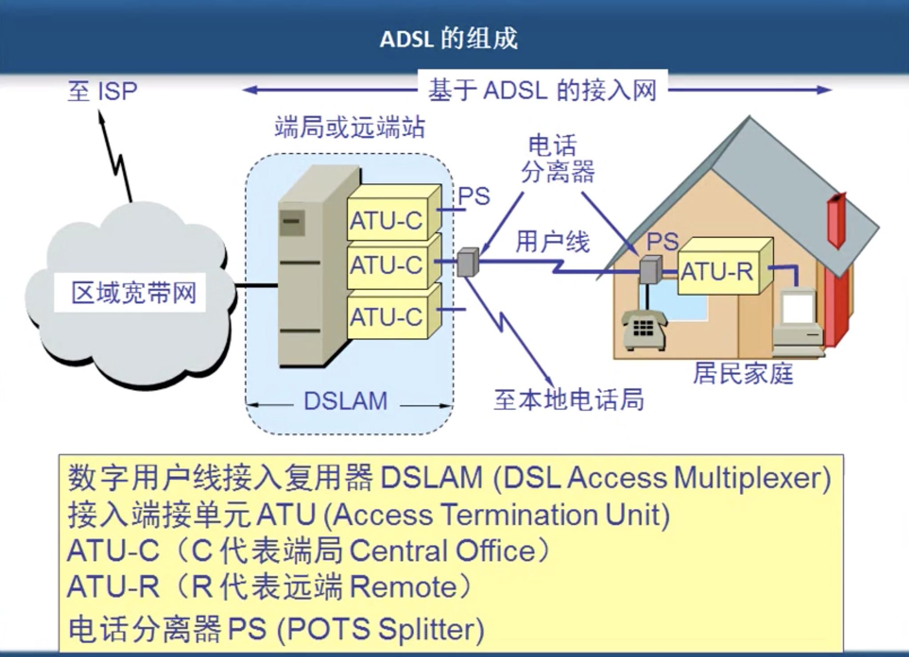
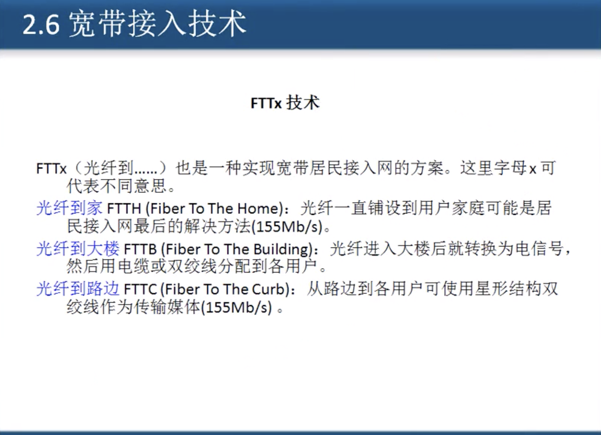

# 2.6 宽带接入技术

## 

## DMT技术

DMT 调制技术采用频分复用的方法, 把40kHz 以上一直到1.1MHz 的高端频谱划分为许多的子信道其中25个子信道御用上行, 而249个子信道用于下行信道.

每个子信道占据 4kHz 带宽, 并使用不通的载波\(即不通的音调\) 进行数字调制. 这种做法相当于在一对用户线上使用许多小的调制解调器 _**并行的**_ 传送数据.

## ADSL上网机制

## 光纤入户

