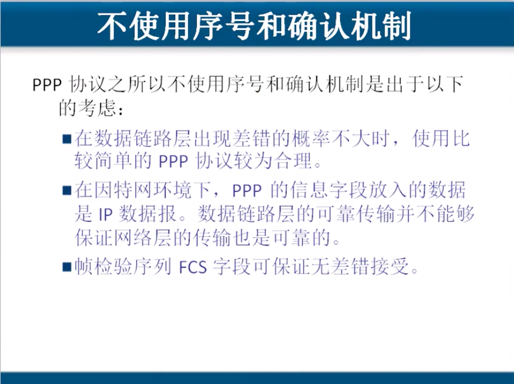

# 3.2 两种情况下的数据链路层

## 使用点对点信道的数据链路层

#### 现在全世界使用的最多的数据链路层协议是点对点协议PPP\(Point-to-Point Protocol\)

### PPP协议是数据链路层协议,用于点对点通信,而且用户使用拨号电话线介入internet的时候,一般都是使用PPP协议. 

### 点对点一般应用于广域网

### PPP协议是帧的透明传输解决方案和esc数据字符串的透明传输不同,他是将和帧尾或帧头相同的字节转换成其他的字节来传输,到达目的地后,会再次转换会原来的字节.

## 使用广播信道的数据链路层

### 广播信道一般用于局域网

