# 3.3 以太局域网\(以太网\)

## 载波侦听和多路访问\(多点接入\)

### hub集线器  不能达到全双工, 就算接入在交换机也不行.

## 概述 

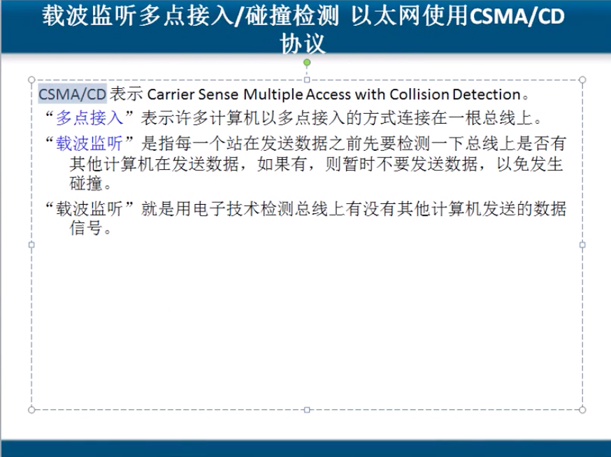

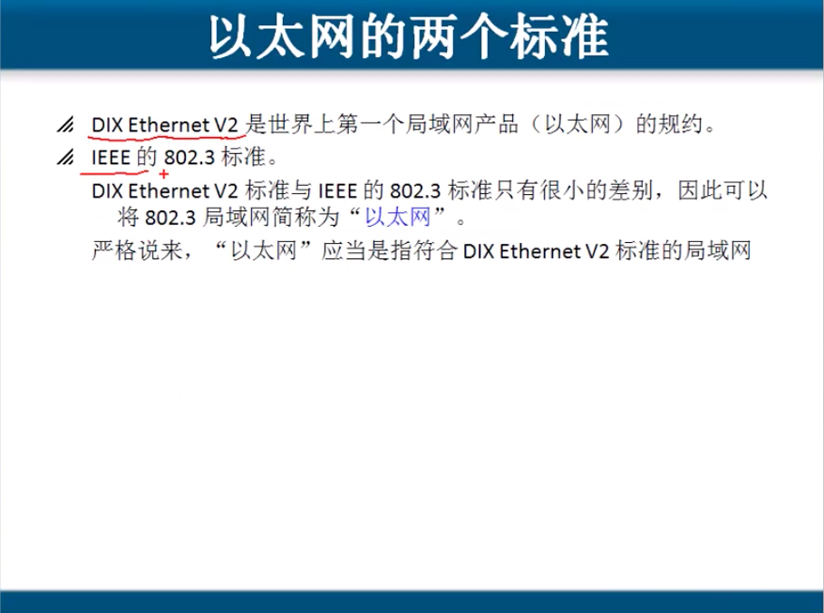

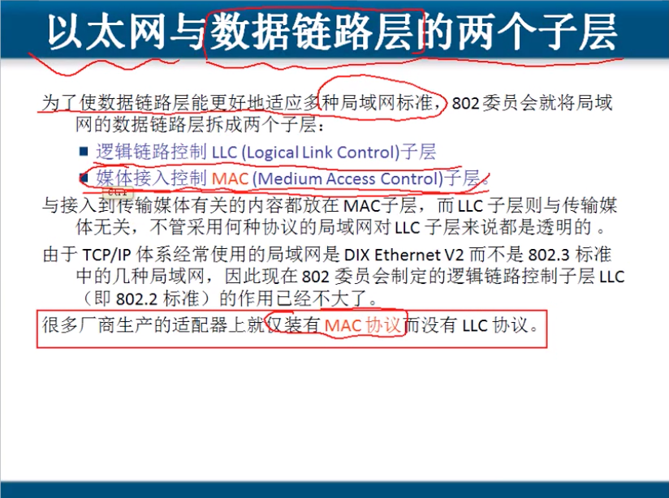

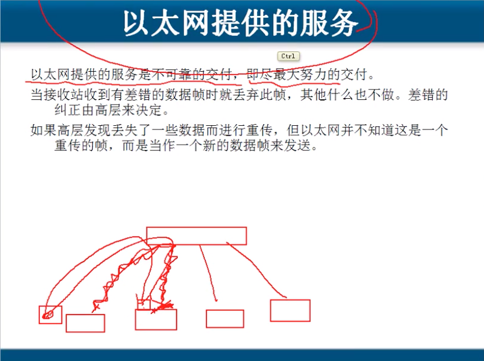

## 拓扑

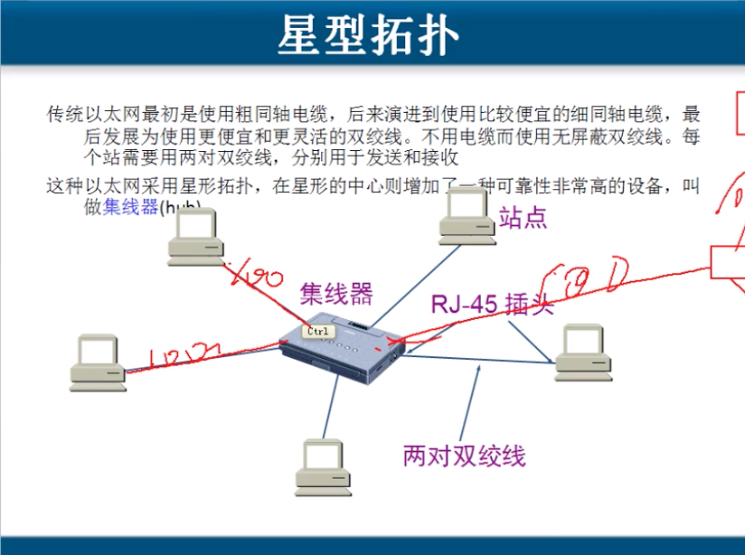

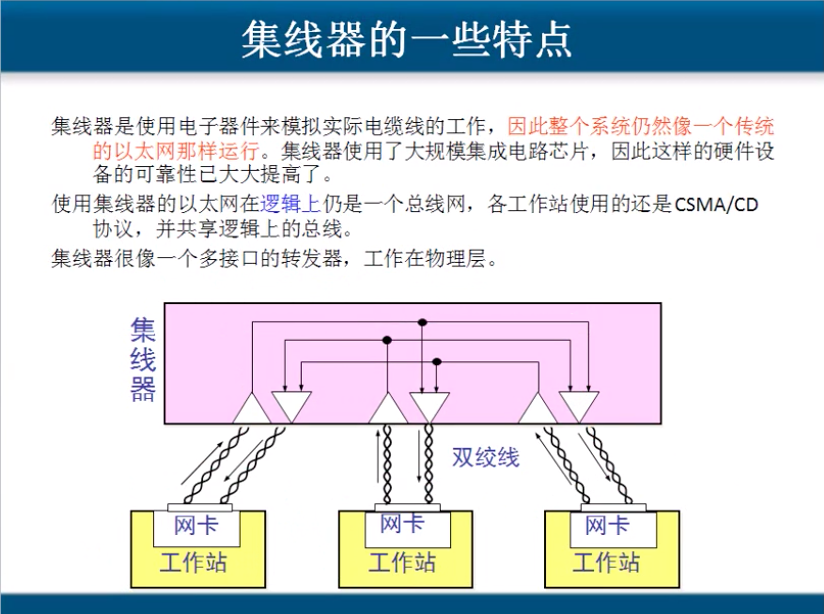

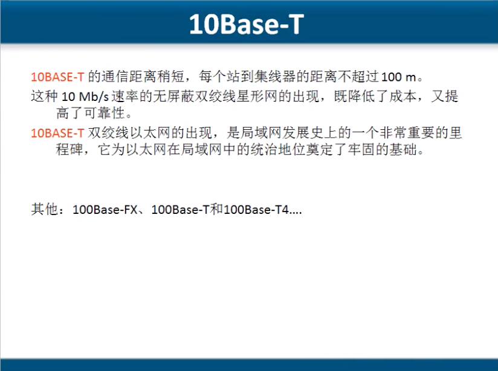

## 信道利用率

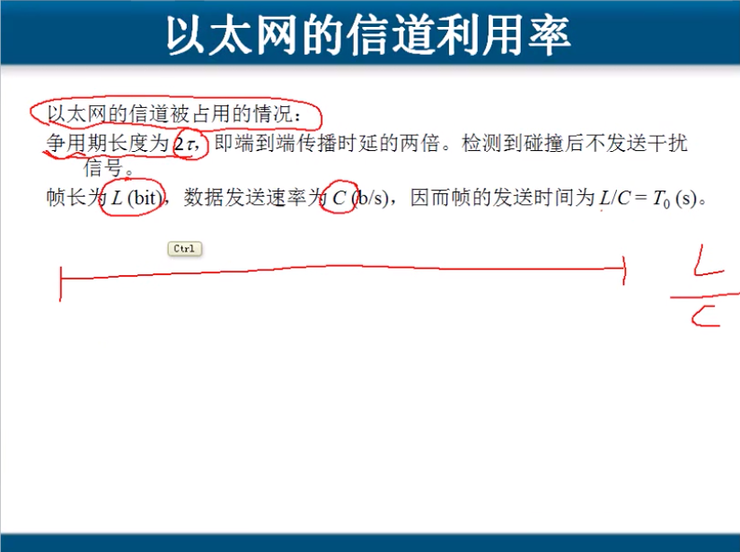

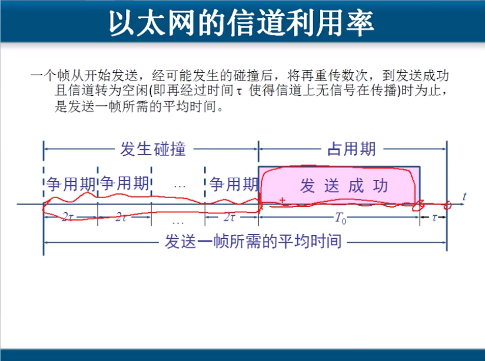

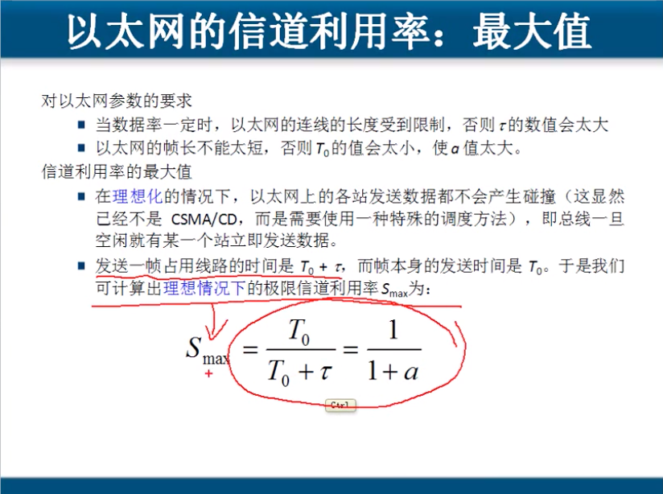

## MAC层

### MAC层又叫 媒体访问控制层

### 最常用的MAC帧是 以太网V2的格式 \( DIX Ithernet V2标准\).

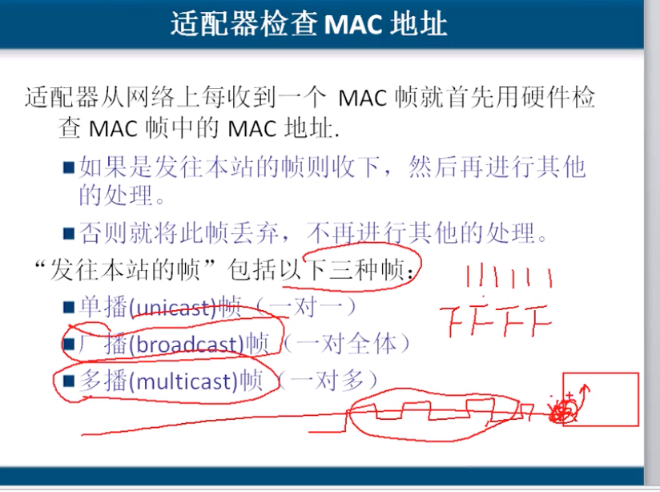

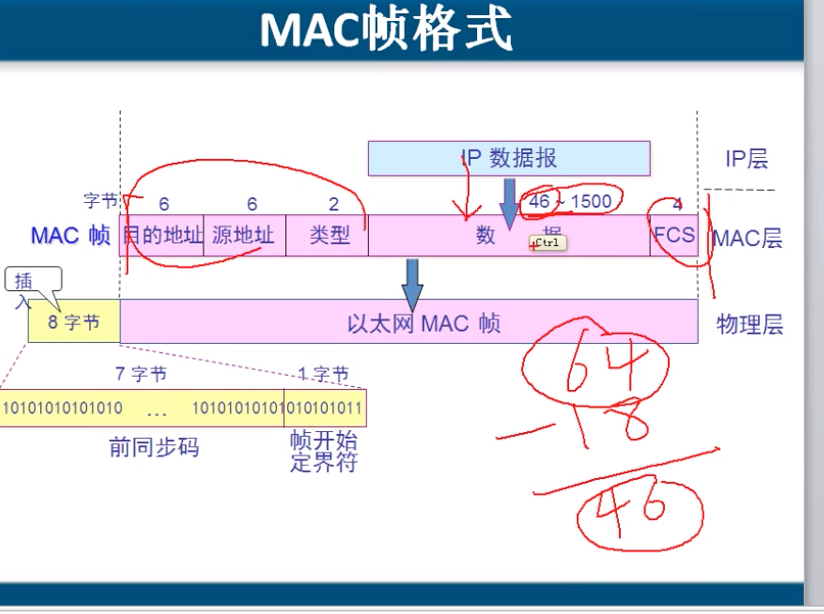

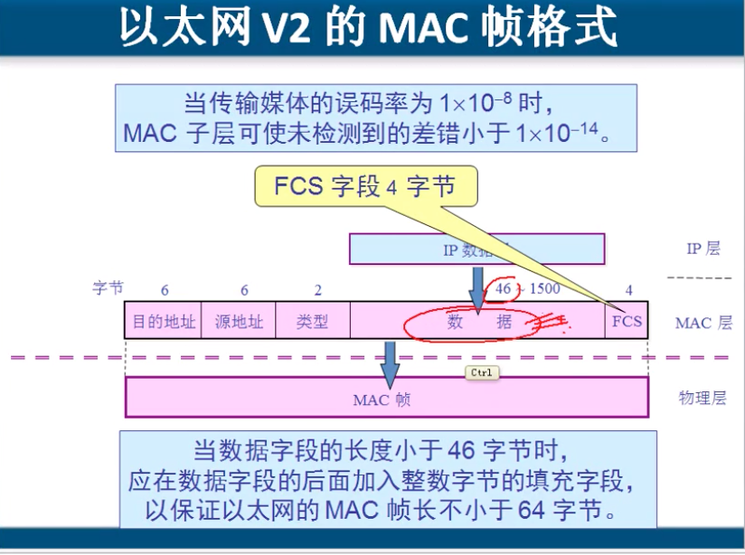

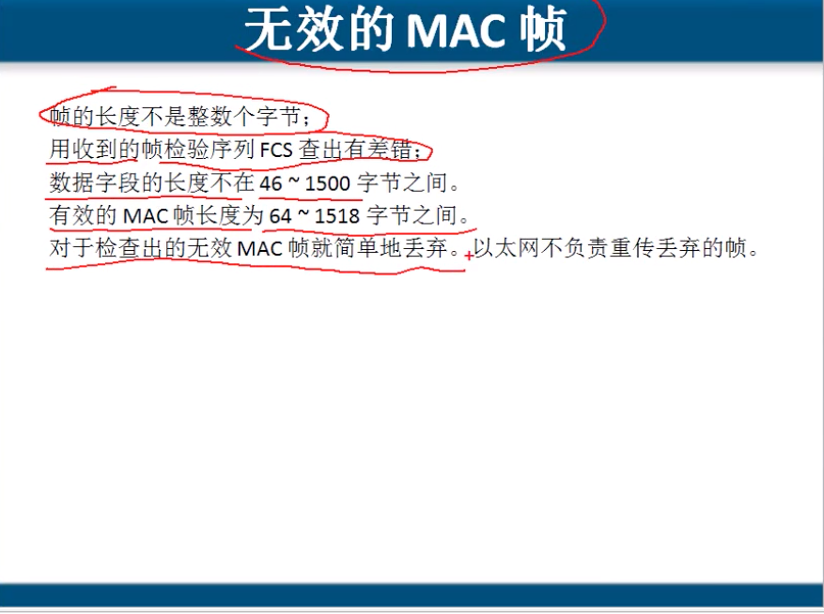

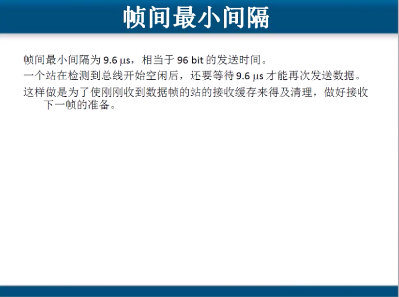

