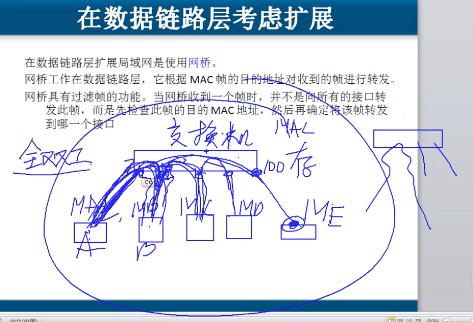

# 3.4 扩展以太网

#### 距离扩展,  超过100M,  物理层使用光纤来达到目的.

#### 集线器级联 ,    使网络中计算机数量增加, 但是效率低.  造成了一个大的冲突域.

**交换机上每个设备的网口都有缓存,可以存储转发过来的数据, 并且还可以屏蔽抓包工具, 安全性有很大提高,而且每个口都是独立的,那么就代表没有阻塞和争用期了,网卡可以达到最大速度和全双工通信.**

_交换机  端口带宽独享, 安全,  基于MAC地址转发, 通过学习构建MAC地址表来转发数据._

思科路由器命令:  Switch\# show mac-address-table

