# 4.11 IP地址的分类 ABCDE 类IP

## 地址的分类就是将开头的三个字段转换成二进制, 0-255 

### 类地址前面的是网络部分, 后面的是主机部分, 124.0.1.1   :124是网络, 后面都是主机

### 0000 0001 - 0111 1111   , A类地址.  从1 到126 , 例子: 14.1.3.4 

### 1000  0000 - 1011 1111   , B类地址.  从128 到191  , 例子: 129.2.3.4 

### 1100  0000 - 1101 1111   , C类地址.  从192 到223 , 例子: 193.4.5.6

### 1110  0000 - 1110 1111   , D类地址.  从224 到239  , 例子: 224.3.2.1

### 1111  0000 - 1111 1111   , D类地址.  从239 到255  , 例子: 239.3.4.3

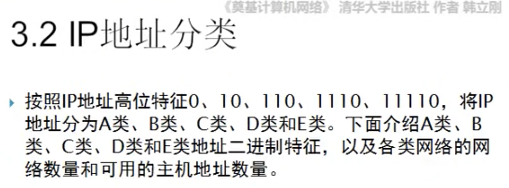

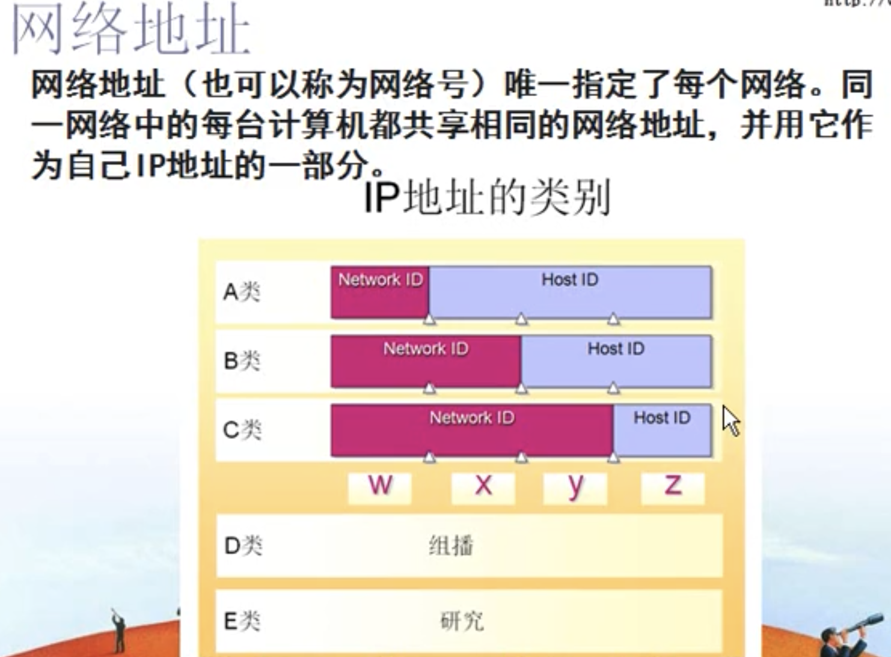

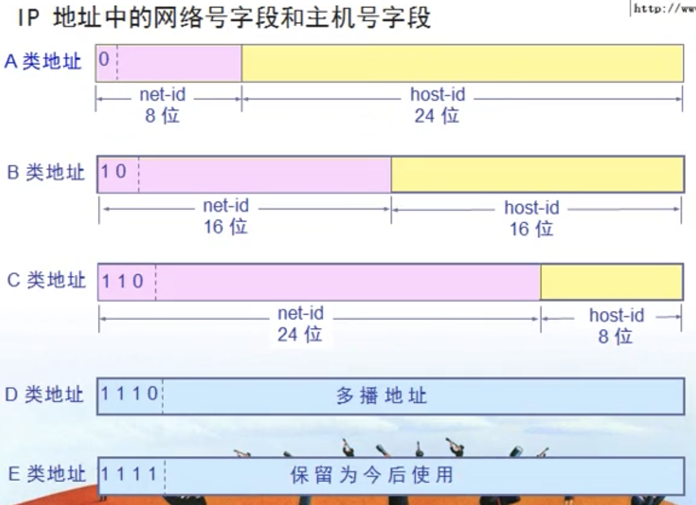

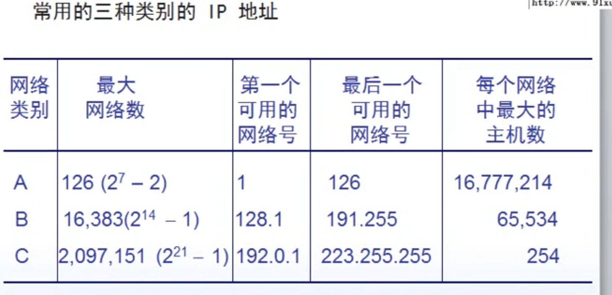

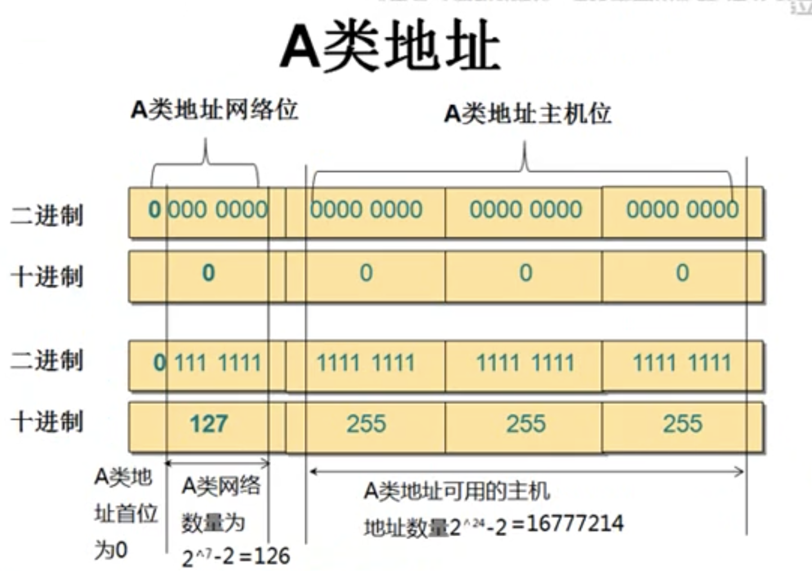

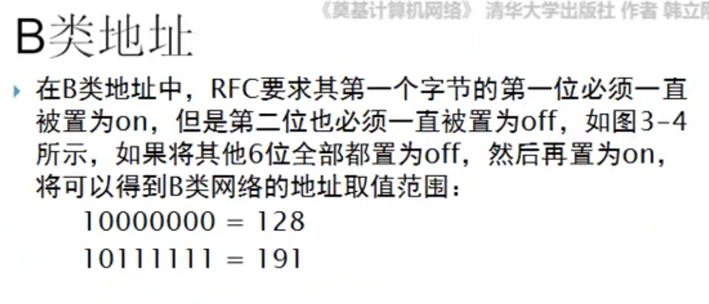

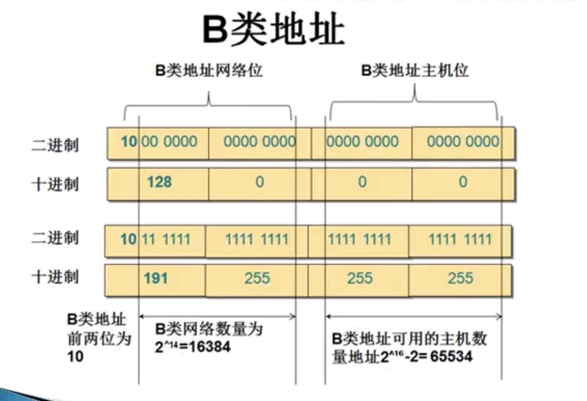

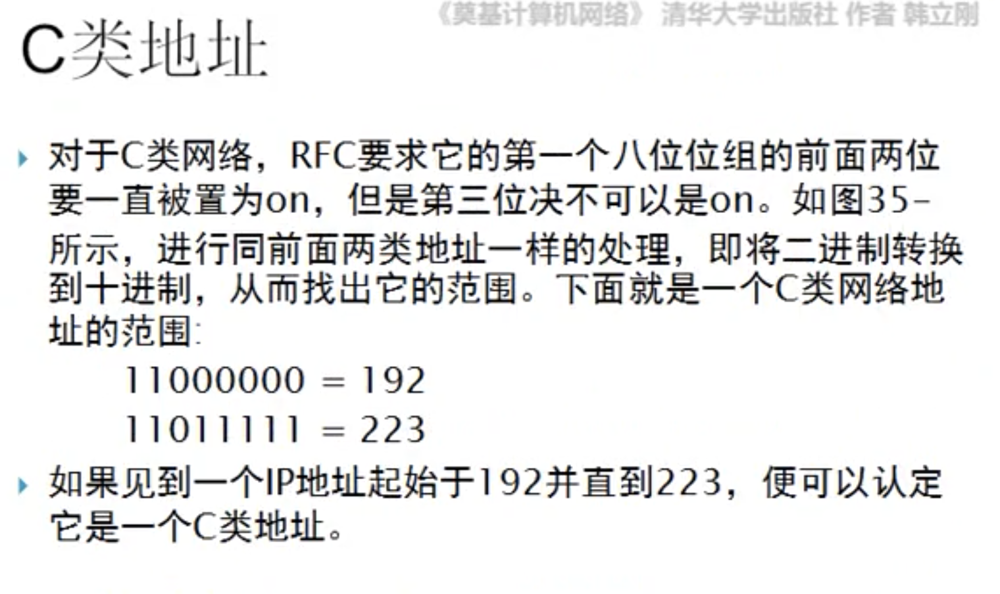

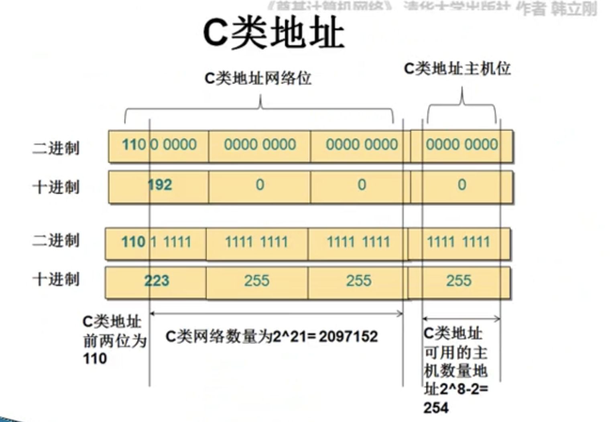

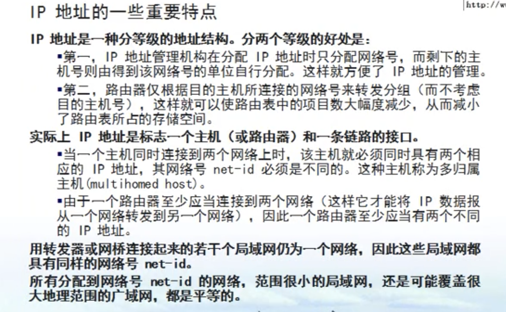

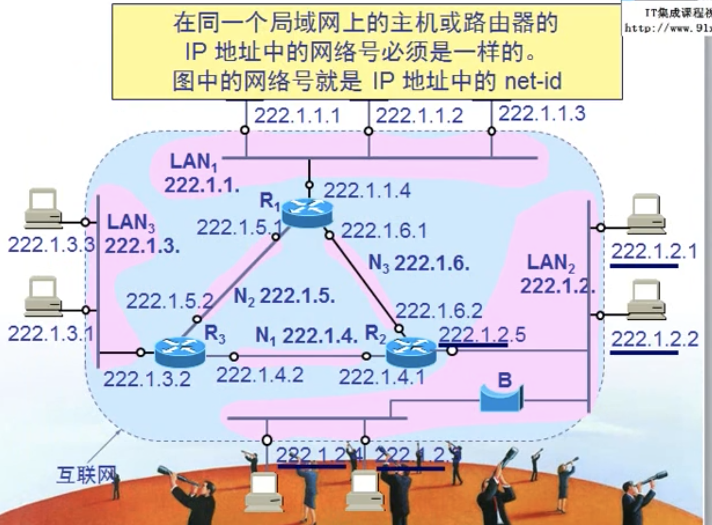

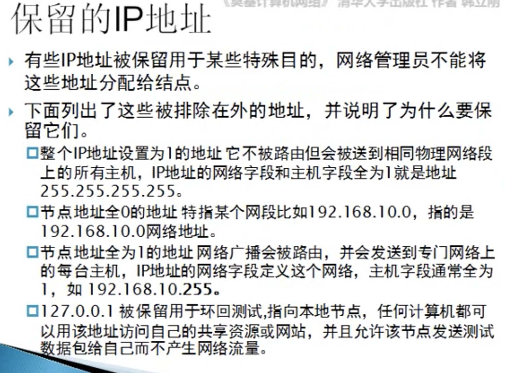

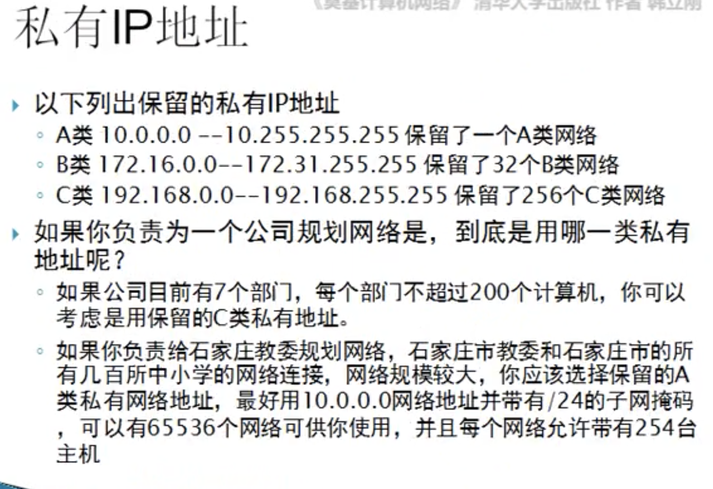

