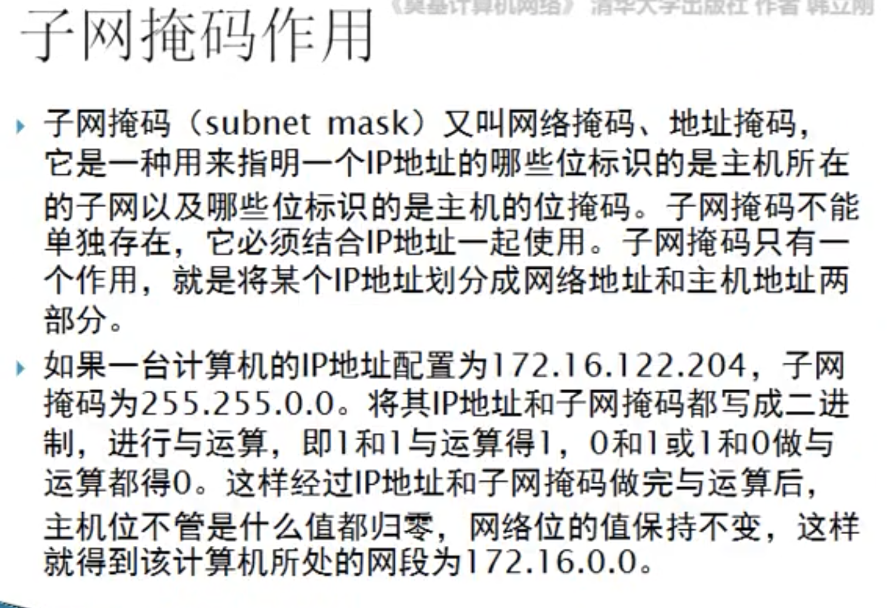
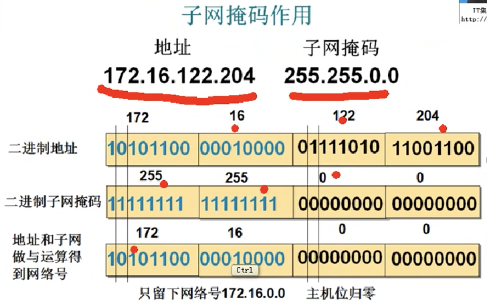
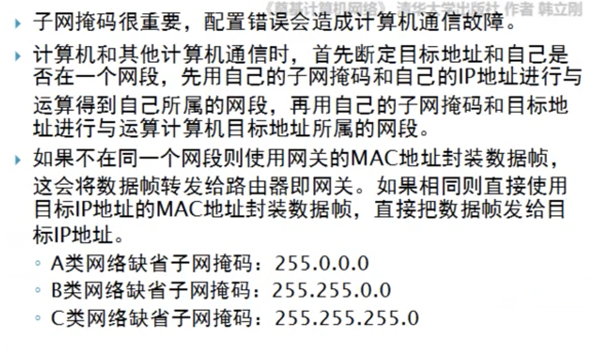
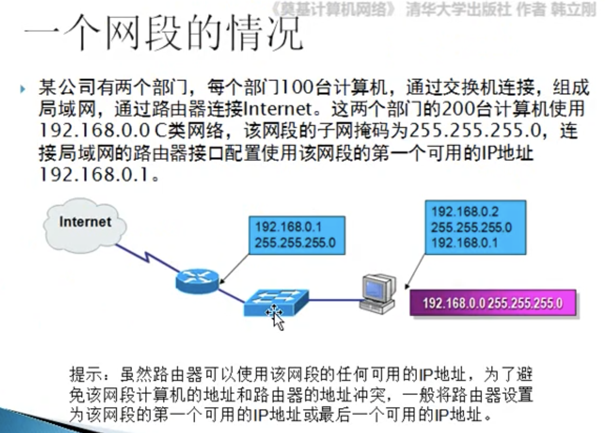

# 4.12 IP和子网掩码

## 子网掩码是判断两个IP主机是否在一个网段的关键信息

### 可以通信的配置

#### A主机配置为     IP: 12.3.4.5    子网掩码     255.255.0.0     网关 12.3.0.1   同一个的路由器

#### B主机配置为    IP:  12.3.4.6    子网掩码     255.255.0.0     网关 12.3.0.1   同一个的路由器

### 无法通信的配置

#### A主机配置为    IP:  12.3.4.5    子网掩码     255.255.255.0     网关 12.3.1.1   同一个的路由器

#### B主机配置为    IP:  12.3.4.6    子网掩码     255.255.0.0          网关 12.3.1.1   同一个的路由器

