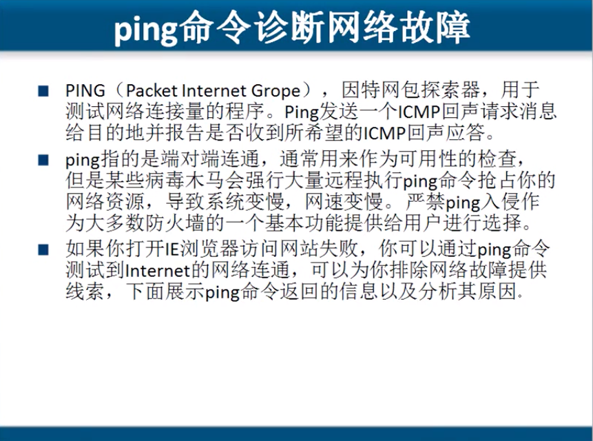

# 4.7  网络层协议:网际控制报文协议   ICMP

### ICMP 协议可以用来判定,网络是否畅通.和一些诊断信息.

## ping 是应用层的,但是它调用网络层的协议.

### ping 之后会返回各种各样的参数.  TTL就代表生存时间.

* Linux  64
* Windows 128
* Unix    255

#### 可以依据上面的返回TTL生存周期,可以大概的判断对方使用的系统. 这个TTL是对方给我的.

## PING 命令的参数

* ping -t    IP或域名                **一直PING**
* ping -l 数字  IP或域名          **数字指定发送包的大小**,**一般指定大小是 200.**
* ping -i 数字  IP或域名        **指定TTL的生存周期** \(可以使用这个来判断自己的二级路由IP, 设定为2,就是第二个路由返回给我信息和他的地址, 设定为1,就是第一个路由返回给我信息和他的地址\)

## traceroute 命令

**跟踪包经过路径的命令**  , 这是个高级命令.

