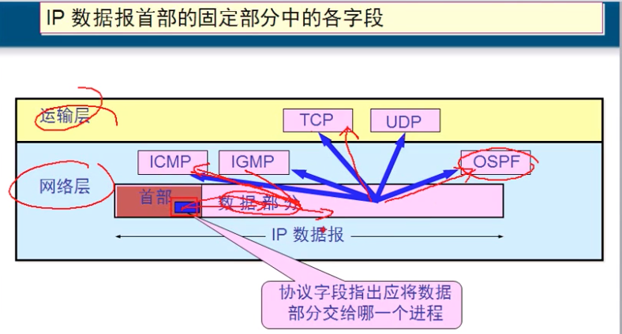

# 4.9  网络层协议:IP数据包格式

## IP数据包

#### 一个IP数据包由首部和数据两部分组成

* 首部的前一部分是固定长度, 共20字节, 是所有IP数据报必须具有的.
* 在首部的固定部分的后面是一些可选字段, 其长度是可变的.

### IP数据包详解\(请注意是大端表示法\)

1. **版本**   占了4个bit,  用它来表示TCP/IP协议是哪个版本的   ipV4 或者 ipV6 , 里面的值是4的话就代表是ipv4, 6就是ipv6. 二进制是 0100 
2. **首部长度**   占用4个bit, 他表示数据包首部长度\(bit\),过了这个长度就到数据了,一般表示是20, 他的每一位就代表4字节, 0101 = 十进制的20,  表示首都长度是20, &lt;不是2次方,而是4次方,计算方式不同&gt;, 最大可以表示
3. **区分服务TOS**   占8个bit, 传输流量的优先级, 他表示让路由器有限处理这个包,还是稍后处理,还是默认处理.
4. **总长度**   占16bit, 用来表示整个数据包的总长度\(首部+数据部分\). 最高表示 2^16 -1 = 65535
   1. _数据链路层_  数据长度最长 1500字节,   最大传输单元 MTU, 如果上层数据太大,那么数据链路层会执行分片, 将数据分切之后再循环全部发出.
   2. 数据包 如果不分片,  数据包数据最大不超过1480字节.
   3. 数据到达目标后, 网络层会查看下面的 **标识**  如果值相同就将分片组合起来, 变成完整的包. 继续向上层传递, 如果接收不完整,那么他会丢弃所有的包.
5. **标识**   占16bit, 标示一个完整的数据包, 便于分片之后,组成一个完整的数据包.
6. **标志**    占3bit,   目前只有前两位有意义, 最高位只能是0., 如果没分片是010,  分片是001,或000
   1. 标志字段的最低位是MF, MF=1 表示后面还有分片, 为0 表示这是最后一个分片.
   2. 标志字段中间的一位是DF, 只有当DF =0 时,才允许分片.
7. **片偏移**  占12bit,  当封包进行分段的时候会为各片段做好定位记录,以便在重组的时候就能够对号入座, 一般的单位是8.
8. **生存时间**   占8bit, 每过一个路由器TTL需要修改-1 ,而且这个生存时间也要修改-1 .
9. **协议**    占8bit,  表识后面数据是什么协议\( UDP/TCP/IP..... 等等很多协议\),指出应将数据部分交给哪个进程来处理.
   1. ICMP 协议号是  1   ,    IGMP 协议号是 2    ,     TCP  协议号是 6    , UDP  协议号是 17
   2. IPv6  协议号是   41  ,   OSPF 协议号是 89 
10. **首部检验和**   占16bit, 用来判断首部数据包 是否发生错误或者修改, 如果检验结果为0,则丢弃该包.
11. **源地址**    占32bit, 源IP地址, 发送端,
12. **目的地址**   占32bit, 目标地址 , 接收端.
13. **可变部分:可选字段**    长度可变,但最长不可超过 60-20 =40字节 .目前没有任何用处 ,但是IPv6 直接取消了这个可变部分了.
14. **填充**    ,当可变部分不够,则补充0 变成IP数据包. \(目前也没用\).

