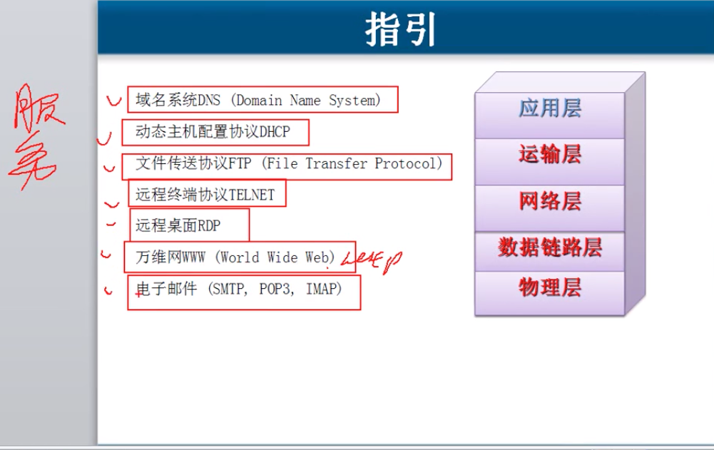
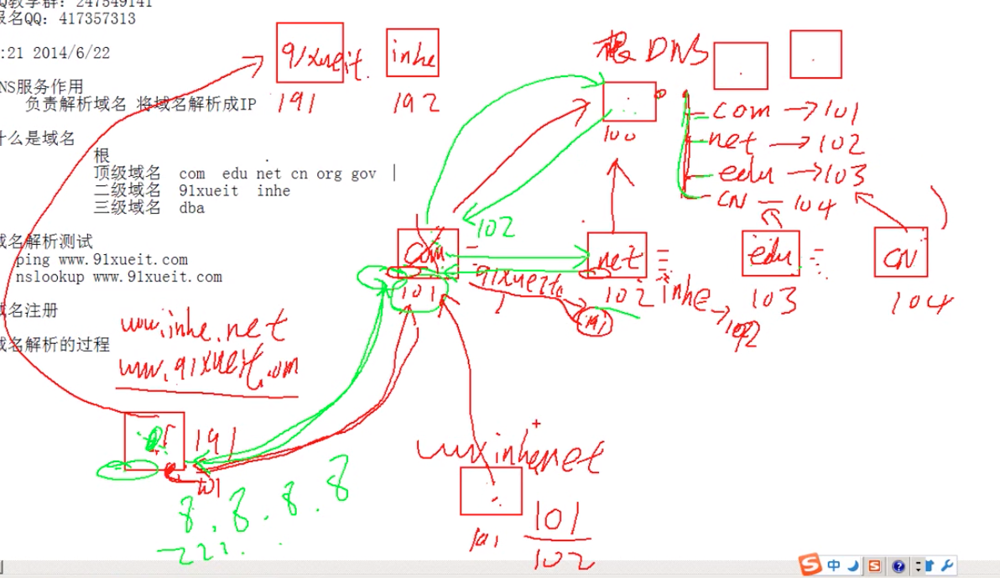

# 6.1 DNS域名

### 域名

https://www.baidu.com.

#### 根    .    就是 com 右侧的点

#### 顶级域名     com   edu  net  cn    org     gov

#### 二级域名    baidu     bilibili

#### 三级域名    www   dba 

域名下的地址,可以有多个,但是域名是全球唯一的.

### 域名解析

#### 域名解析和域名IP查询命令:  $nslookup         随后输入 域名

#### 还有 $ ping  + 域名    

### 域名注册

可以去各大运营商,比如阿里之类的去购买域名,不是很贵.

### 域名解析的过程

**是一种分布式的查询系统**

### 安装自己的DNS服务器,进行域名解析\(windows自带组件内有\)

#### 主要是节省解析流量和解析时间.

**什么情况需要安装内网的DNS服务器**

1. 解析内网自己的域名
2. 降低Ineternet的域名解析的流量
3. 域环境,

\

