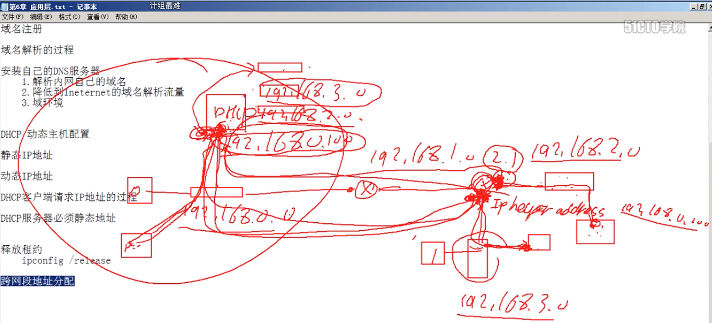

# 6.2 DHCP 动态主机配置  协议

可以分为 **静态IP地址** 和 **动态IP地址**

### **静态IP地址**

上网设备手动设置和指定IP地址和子网掩码,但是很容易发生同网段IP冲突

### 动态IP地址

由服务器统一调度调配, 不需要上网设备手动指定, 他会自动分配IP地址和子网掩码.

## DHCP服务器必须是静态地址 .

### DHCP客户端请求IP地址的过程\(跨网段和路由器\)  圈是路由器, 长方形是网段.正方形是电脑

对路由器添加的命令是:   \#ip-helper-address  + DHCP服务器地址.            是路由器跨网段分配IP地址

### DHCP地址租约

释放租约地址命令:       $ipconfig   -release

获得租约地址命令:       $ipconfig   -renew

