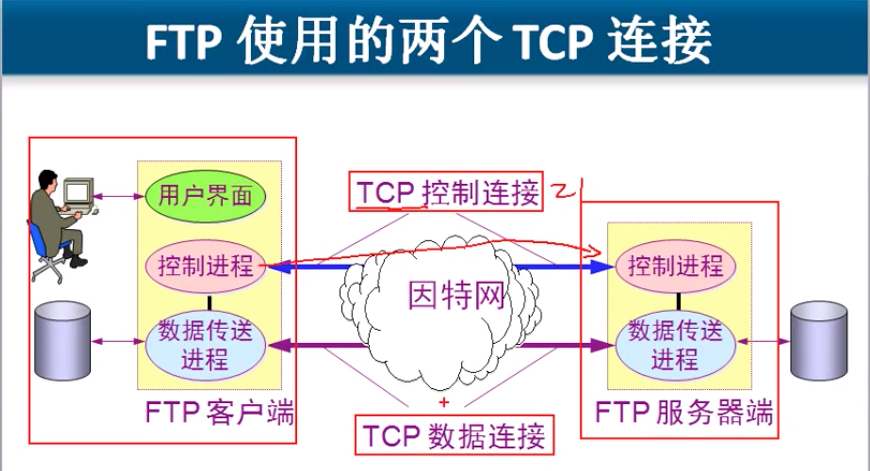
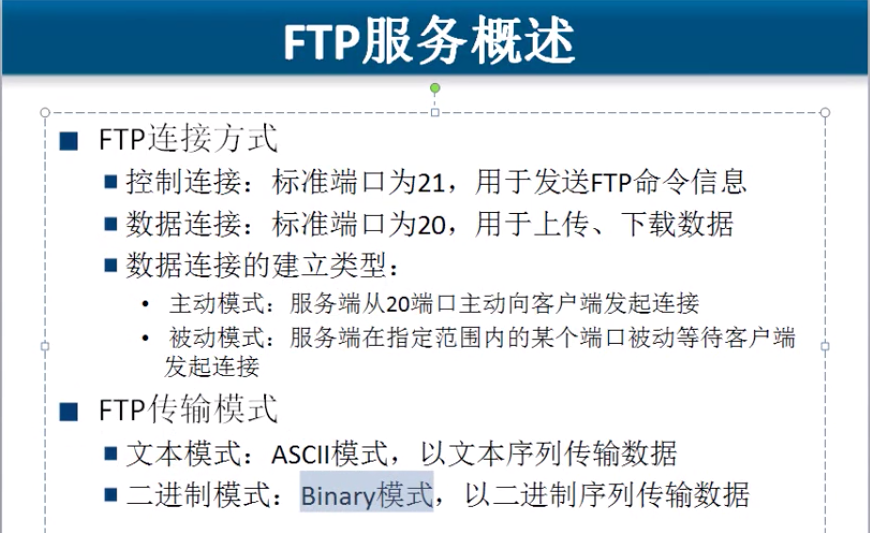
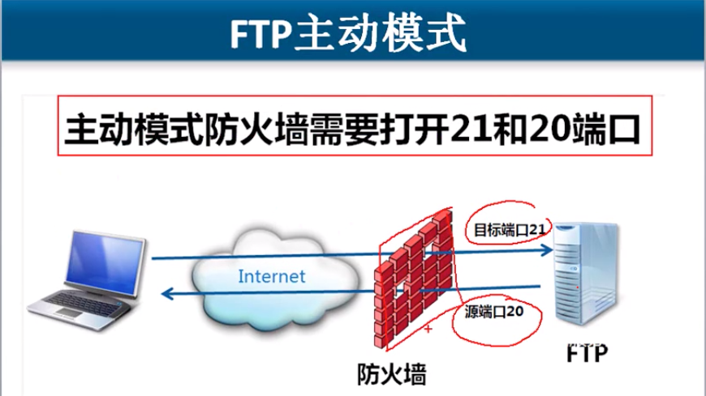
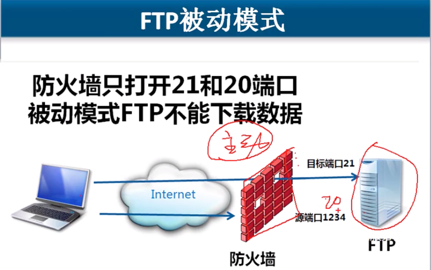

# 6.3 FTP协议

## FTP中的 TCP数据连接 有两种方式. 主动和被动   , \(控制先连接\)

### 主动模式    \(服务器端的防火墙只需要开启 21和20端口就行\)

**FTP客户端告诉FTP服务器使用什么端口侦听,   FTP服务器和客户端的这个端口建立连接.** 

服务器固定的从20端口主动向客户端发起连接, \(客户端的端口是临时指定的,传输前会告知服务器\).

### 被动模式

**就是FTP服务器打开一个随机端口, 等着客户端来连接这个端口, 如果服务器配置了防火墙, 那么访问就不可能成功.**

\*\*\*\*

#### 谁发起的连接,那么他就使用20端口, 接收端使用随机端口. 这个就是主动模式和被动模式.

## FTP服务器端,  如果有防火墙, 需要在防火墙开 21和20端口,使用主动模式进行连接

## 主动连接 还是 被动连接   是由客户端决定的, 如果客户端被动模式无法访问服务器,那么切换主动模式就可以了

 

