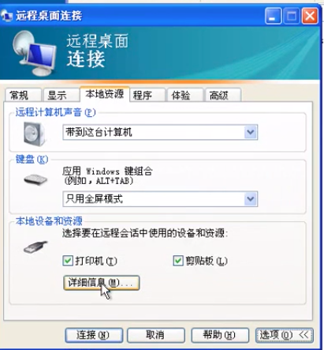
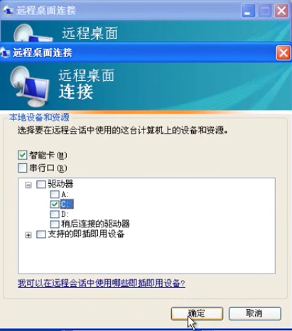
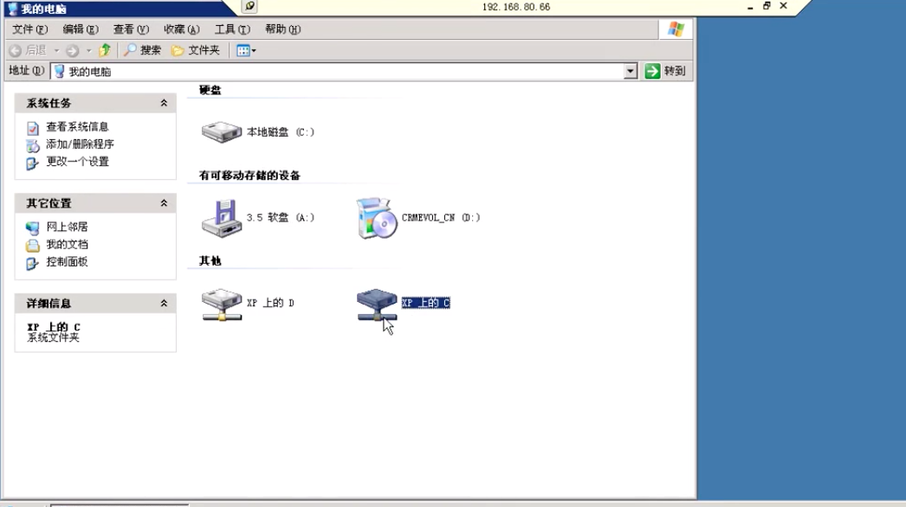

# 6.5 RDP远程桌面协议

## 使用的是 TCP 3389端口

将用户添加到 远程桌面组  就可以连接过来,  管理员自带权限 .

### 如果是windows server系统, 则最大连接是 2个

### 如果是windows 普通系统,  则只允许一个用户在线, 要么本机用户,要么远程用户, 同时只能存在一个.  一个登陆一个退出. 但是桌面只会存在一个, 他俩共享. 就算退出了 也不会改变.

## 客户端远程连接的设置中还可以将本地的硬盘映射到与远程端.

