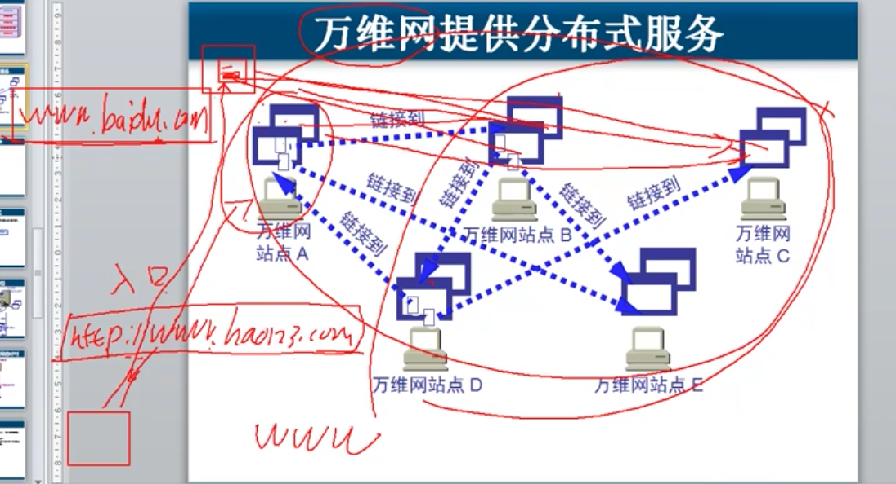
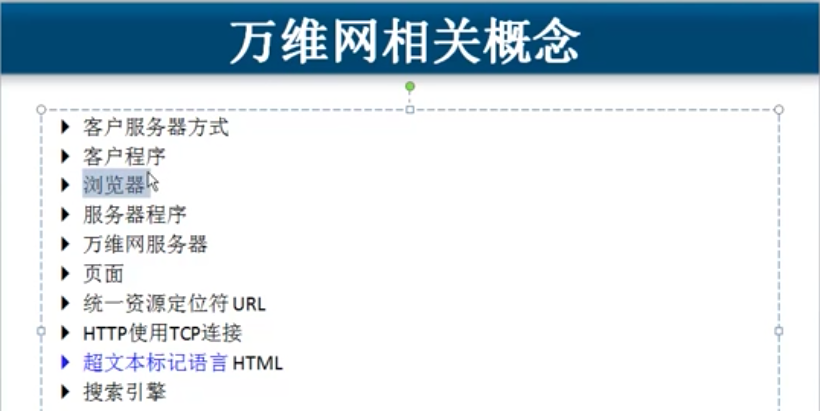
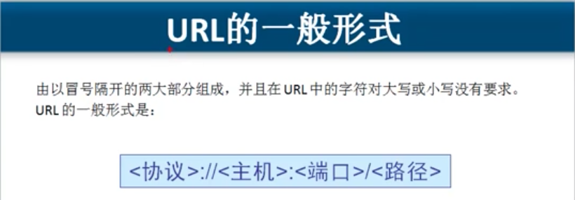

# 6.6 HTTP 超文本传输协议    \(www 万维网\)

### 同一台服务器,同一个IP地址和80端口, 运行多个网站和服务,  使用主机头\(域名\)来实现.

## www  万维网 通过  url 相互链接






## URL



一个URL范例:        [http://192.168.1.1:222](http://192.168.1.1:9999/share)/www/index.html

#### http是协议,   192.168.1.1  是主机或者域名,      :222 是端口\(如果是80端口则不显示\),     www/index.html  是路径

## HTML 超文本标记语言

### 在www 网页存放目录下,  index.html  这个名字的网页就是默认初始页面.

```markup
      <!doctype html>  声明文档类型, 必须写在文件开头
      <html>  文档的头部号 和 主体内容  </html> 根标记
        <head>  里面存在一个 <title></title> 文档的头部信息 </head> 只能有一对
            <title> 显示在浏览器窗口的标题栏中"网页名称" </title> 位于 head 标签之内
        <body> </body>  主题标记位于 <html> 之内, <head>标签之后
    <!-- 注释 -->
      
    例:
      <html>
        <head>
            <title> 这是一个标题 </title>
        </head>

        <body>
            <font color="red" size="5"> hello, world </font>    // 修饰 he 这个文本进行显示
           <table border="3" bordercolor="blue" width="500" height="500" background="./3.png">
                <tr align="center">
                    <td align="center">姓名</td>
                    <td>年龄</td>
                    <td>性别</td>
                </tr>
                <tr align="center">
                    <td>张3</td>
                    <td>23</td>
                    <td>男</td>
                </tr>
                <tr align="center">
                    <td>李四</td>
                    <td>24</td>
                    <td>女</td>
                </tr>
                <tr align="center">
                    <td>老王</td>
                    <td>56</td>
                    <td>不知道</td>
                </tr>
            </table>
        </body>
      </html>
```


http 协议- 应用层 -请求消息\(Request\) - 浏览器给服务器发 四部分: 请求行,请求头, 空行, 请求数据 请求行: 说明请求类型, 要访问的资源. 以及使用的http版本\( 一般是1.1 \) 请求头: 说明服务器要使用的附加信息. 空行: 这个空行是必须要求的, 即使没有请求数据.\(一般是是使用'/r/n' 来进行换行的\) 请求数据: 也叫主体, 可以添加任意的其他数据.

* HTTP1.1的五种请求方法 

  ○ GET

  ```text
  请求指定的页面信息，并返回实体主体。 
  ```

  ○ POST

  ```text
  向指定资源提交数据进行处理请求(例如提交表单或者上传文件). 数据包含在请求体中. 
      post请求可能会导致新资源的建立 和/或 已有资源的修改.
  ```

  ○ HEAD

  ```text
  类似于get请求，只不过返回的响应中没有具体的内容，用于获取报头
  ```

  ○ PUT

  ```text
  从客户端向服务器传送的数据取代指定的文档的内容。
  ```

  ○ DELETE

  ```text
  请求服务器删除指定的页面。
  ```

  ○ CONNECT

  ```text
  HTTP/1.1协议中预留给能够将连接改为管道方式的代理服务器。
  ```

  ○ OPTIONS

  ```text
  允许客户端查看服务器的性能。
  ```

  ○ TRACE

  ```text
  回显服务器收到的请求，主要用于测试或诊断。
  ```

## 

## 


