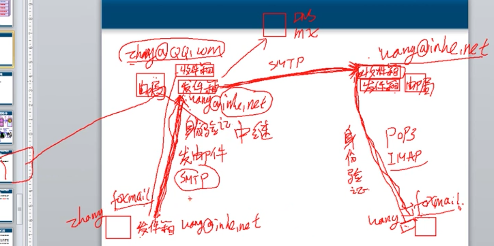

# 6.7 SMTP, POP3,  IMAP  电子邮件

## SMTP 是发送电子邮件协议

## POP3 , IMAP  是接收电子邮件协议

## 在本地建立两个电子邮件服务器和DNS解析服务器, 和收发邮件的两个客户端 的大致步骤

### 首先每个邮件服务器都需要具备 SMTP 和 POP3 服务

1. 安装 POP3 和 SMTP 服务 以及  DNS 服务  \(2台邮件服务器, 1台DNS服务器\)
2. 在DNS服务器上    创建91xueit.com 和 51cto.com ,  并且创建主机记录 mail  192.168.80.100 ,创建邮件交换记录,  MX记录
3. 在 POP3服务上创建域名,  创建邮箱
4. 配置SMTP 服务器,  创建远程域名 \*.com    允许发送到远程
5. 配置 outlookExpress\(邮件客户端\)  使用 POP3 收邮件 和  使用 SMTP 发邮件 的服务器.

## 搭建在Internet上使用的邮件服务器

1. 在Internet 上注册了域名 ,  MX记录
2. 邮件服务器有公网IP地址, 或端口映射到邮件服务器 SMTP   TCP   25 
3. 

