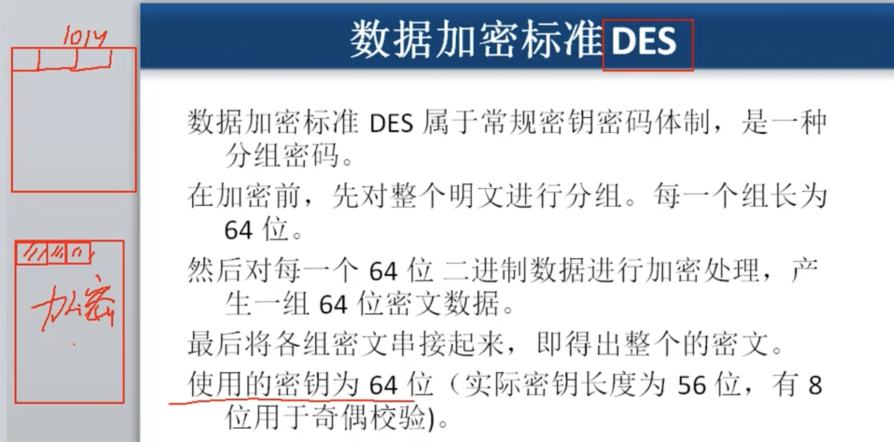
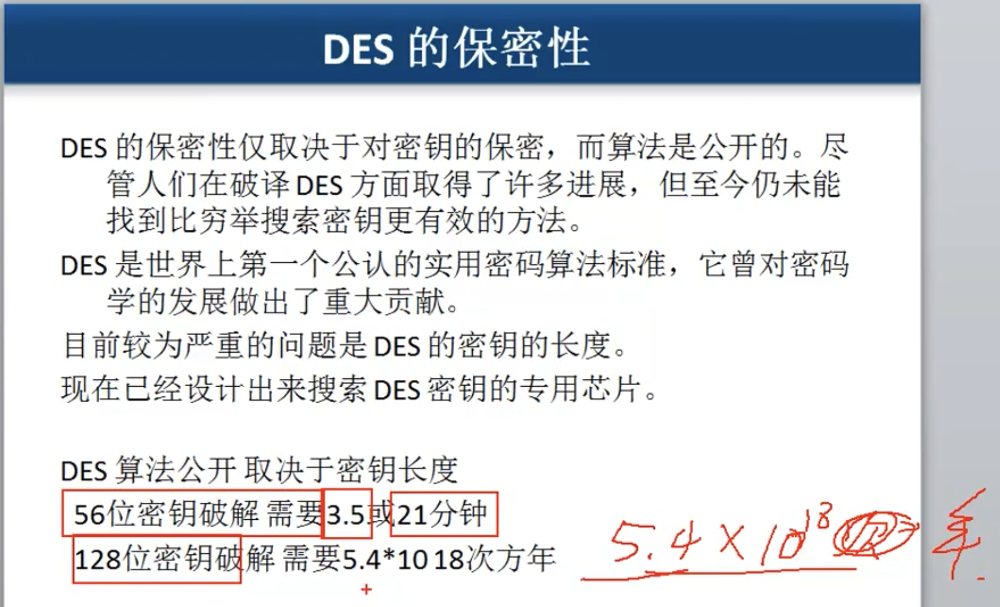
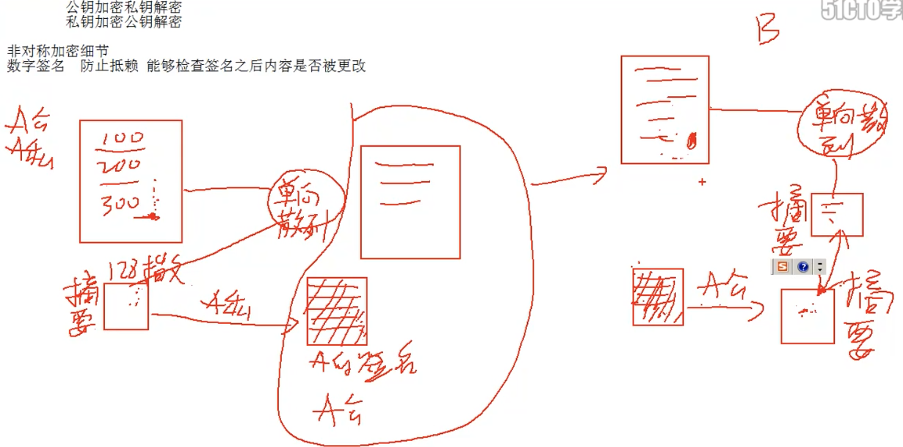
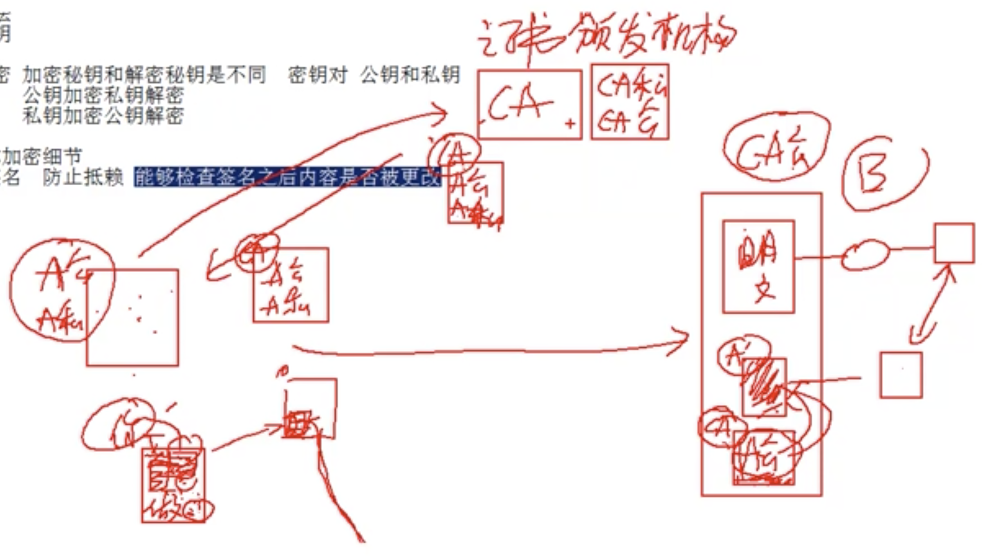

# 7.2 应用层安全: 两类加密技术 和数字证书

## 加密技术 主要有以下两个   对称加密和非对称加密

### 对称加密

#### 加密密钥 和 解密密钥 是同一个 密钥.

#### 加密算法 DES

**优点:  效率高**

**缺点: 密钥不适合在网上传输,   密钥维护麻烦** 

\*\*\*\*

### 非对称加密

#### 加密密钥 和 解密密钥 是不用的,  有两个密匙  公匙和私匙

* 公匙加密  私匙解密
* 私匙加密  公匙解密

可以结合 两个加密方式, 使用字符来对称加密, 然后使用非对称加密来加密字符.

#### 优点: 更加安全

#### 缺点: 效率低下

### 数字签名

**防止抵赖,  能够检查签名之后内容是否被更改, 不是为了保密,而是确认内容没有被修改**

双方传输前,都需要由证书颁发机构的证明,  来确认对方的数字签名真实有效.

**传输的文件不加密. 但是通过私匙加密单项散列函数根据文件运算出的摘要\(就是签名\).然后将 公钥和文件 以及签名   一起传输**  

**当收到数字签名的文件后, 需要使用单项散列函数运算文件, 得到摘要, 然后将随文件一起发过来的公钥和签名进行运算也得到一份摘要,  然后对比两份摘要, 如果相同则没有被修改**

#### 主要是在合同和下发重要文件, 以及开发者的应用中  进行使用.

**A需要先使用公钥和私钥去找证书颁发机构来获取CA的证书和公钥, 然后将CA的公钥来加密自己的A公钥, 然后传输给B,    那这个时候B首先去使用 CA的公钥来验证 CA加密的A公钥是否合法,然后查询A公钥的具体信息,然后 使用A公钥对文件进行验算. 摘要相同,则这份文件是没有被修改的, 是正确的** 

### 证书颁发机构作用

#### 为企业和用户颁发数字证书 , 确认这些企业和个人的身份,    发布证书吊销列表,   企业和个人信任证书颁发机构. 

