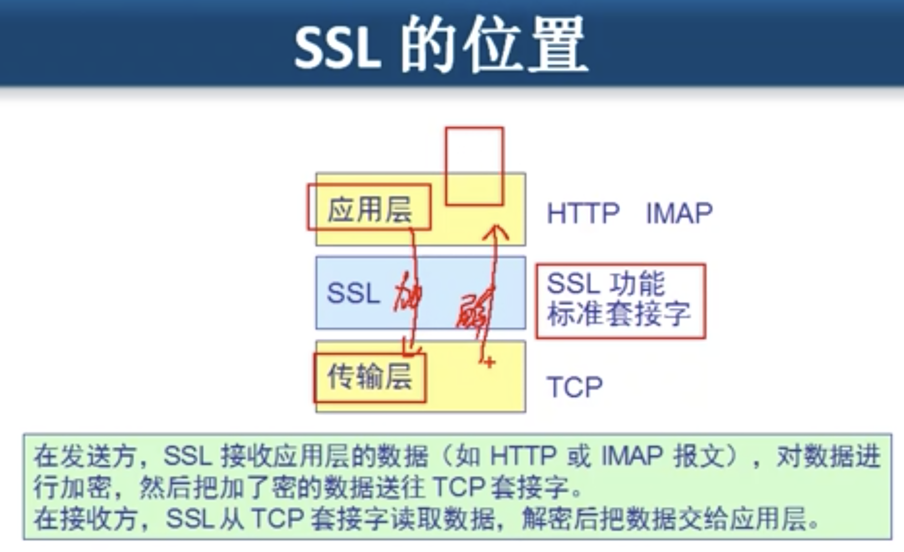
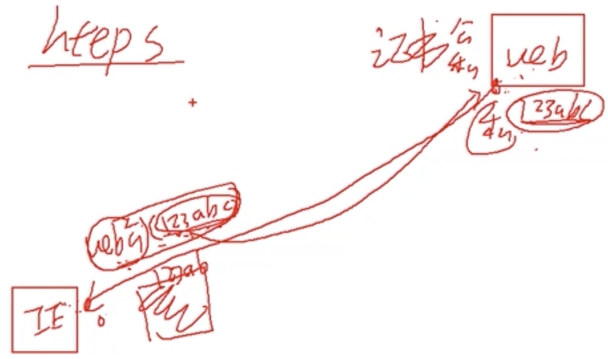
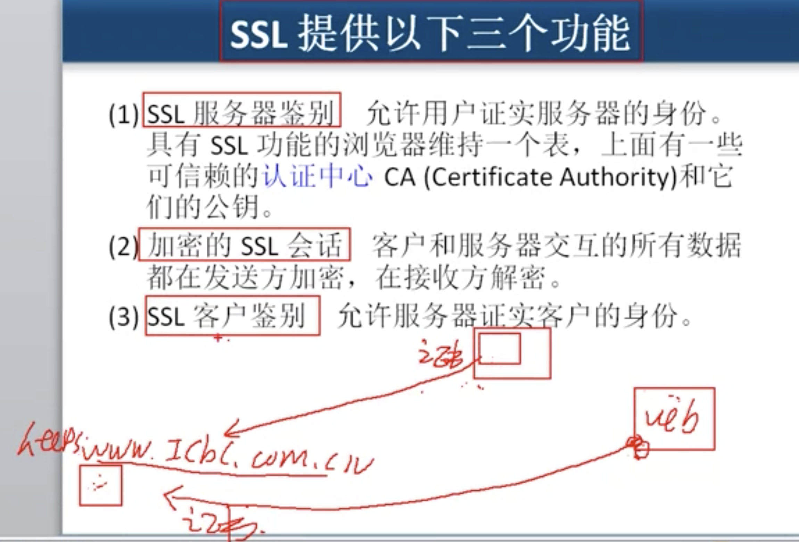
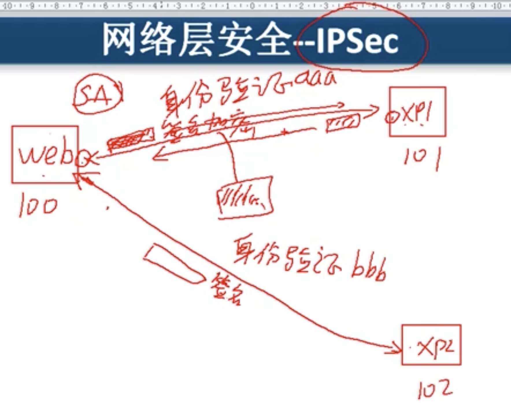
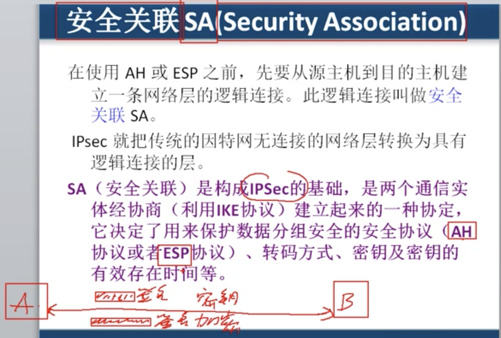
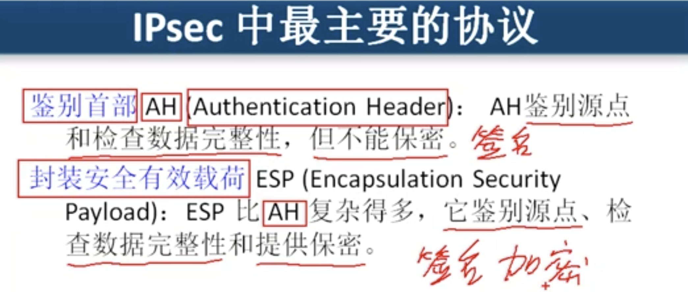
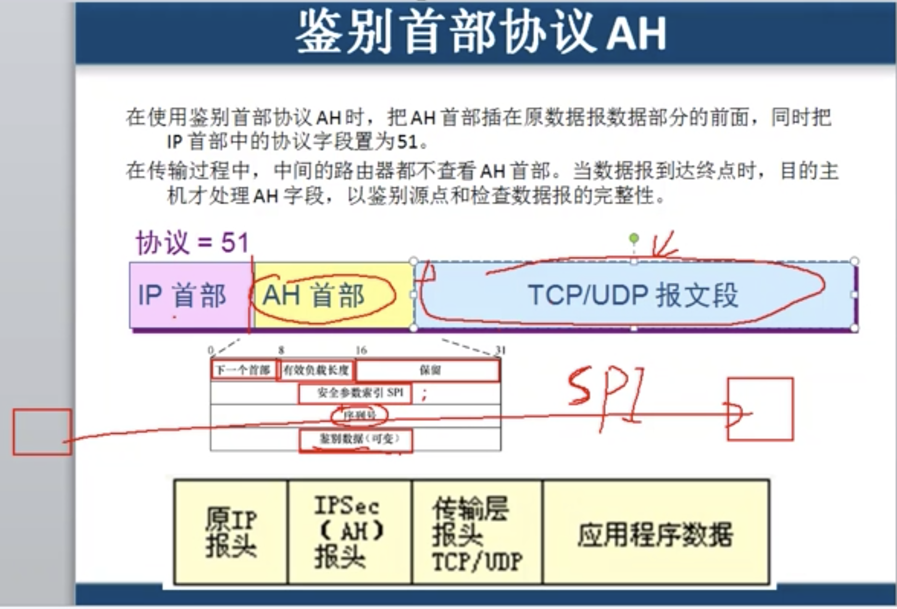
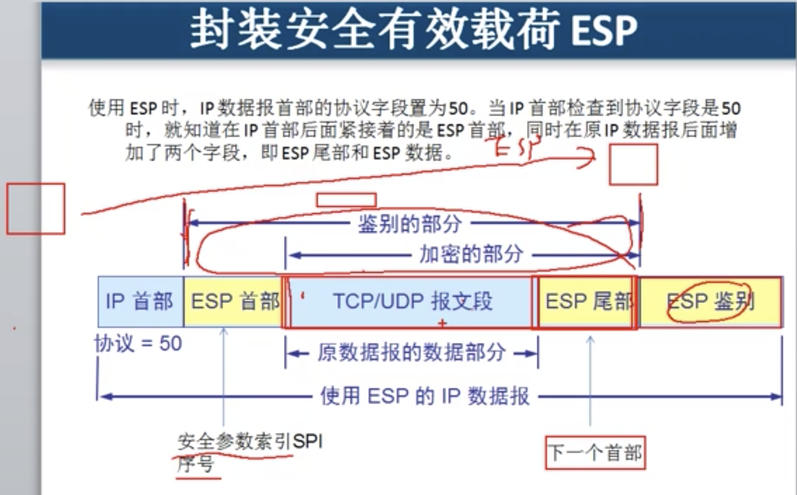

# 7.3 网络层安全: internet 安全协议

## 安全套接字SSL

#### 需要配置证书才能使用SSL,   SSL主要负责加密和解密

#### 而且一旦SSL套接字 参与web服务当中, 那么一般登陆界面都会变成https , 那就代表他们会协商一个 非对称加密的公匙,  然后使用公匙加密后续进行的传输.

安全协议在使用了SSL套接字之后 , tcp使用的端口

* IMAPS    tcp - 993
* POP3S    tcp - 995
* SMTPS   tcp - 465
* HTTPS   tcp - 442

## 网络层安全IPSec

