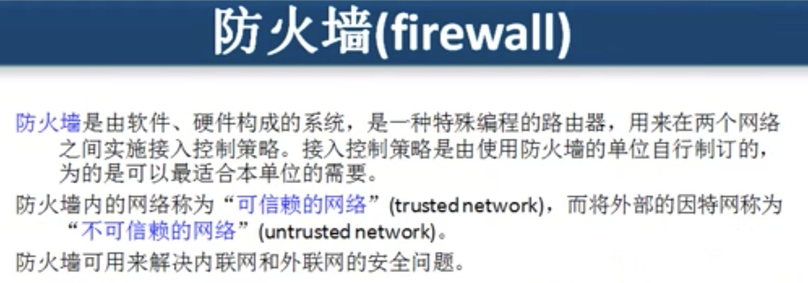
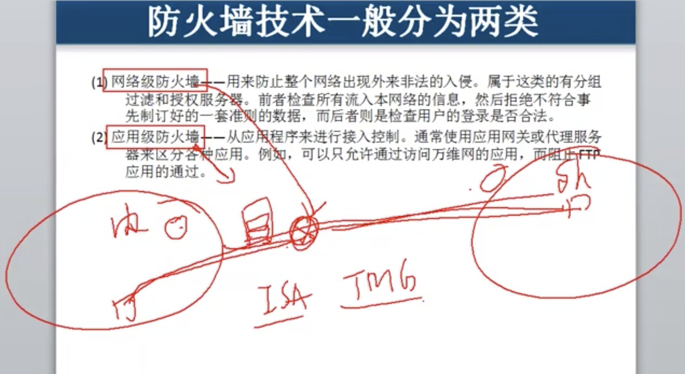
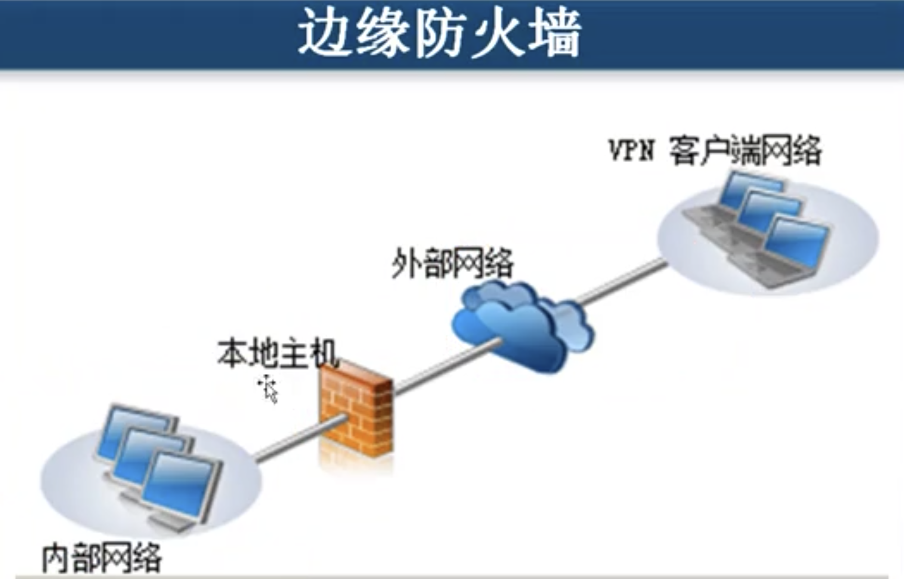
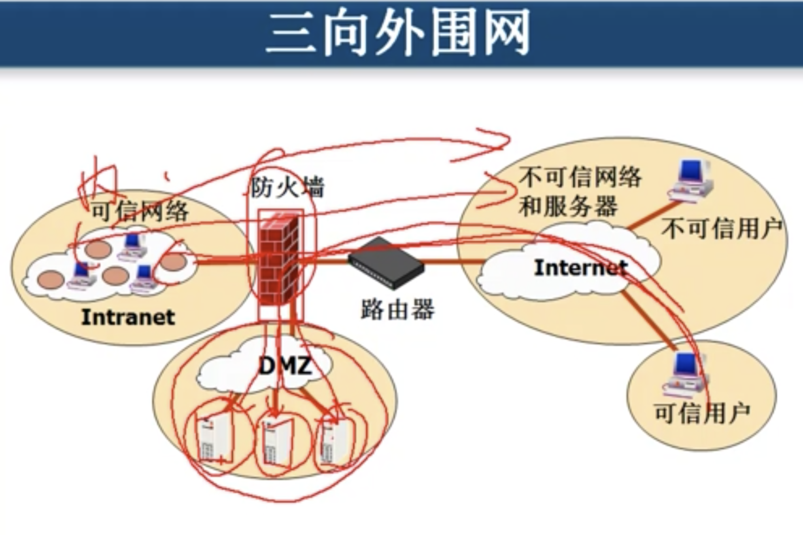
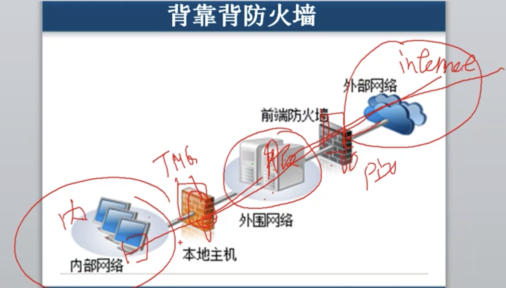

# 7.4 链路层安全: 防火墙

## 数据链路层身份验证   使用的是 PPP协议

### ADSL 拨号上网使用的就是数据链路层的PPP协议来进行验证.

## 防火墙    \(两种\)

#### 网络层防火墙      基于数据包 , 源地址,  比表地址,  协议和端口   流量控制

#### 应用层防火墙      数据包    源地址   目标地址      协议  端口  用户名   时间段    内容   防病毒进入内网

### 三种防火墙

