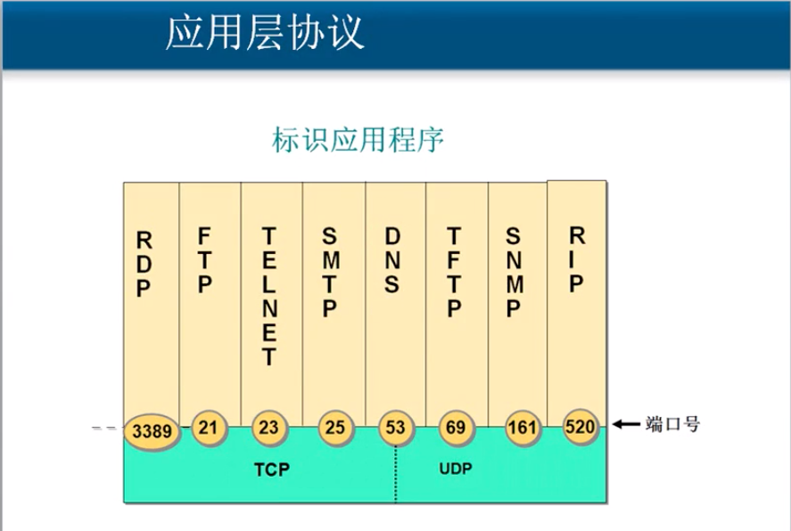

# 5.8 传输层协议和应用层协议之间的关系

### 常见的应用层协议使用的端口

* http = TCP + 80
* https = TCP + 443
* RDP = TCP + 3389
* ftp = TCP 21
* 共享文件夹 = TCP + 445
* SMTP = TCP + 25
* POP3 = TCP + 110
* telnet = TCP + 23
* MSSQL = TCP + 1433
* DNS = UDP + 53  /  TCP + 53

## 服务和应用层协议之间的关系

* **服务使用TCP或UDP的端口侦听客户端请求**
* **客户端使用IP地址定位服务器, 使用目标端口 定位服务**
* **可以在服务器网卡上设置只开放必要的端口,  实现服务器网络安全**

