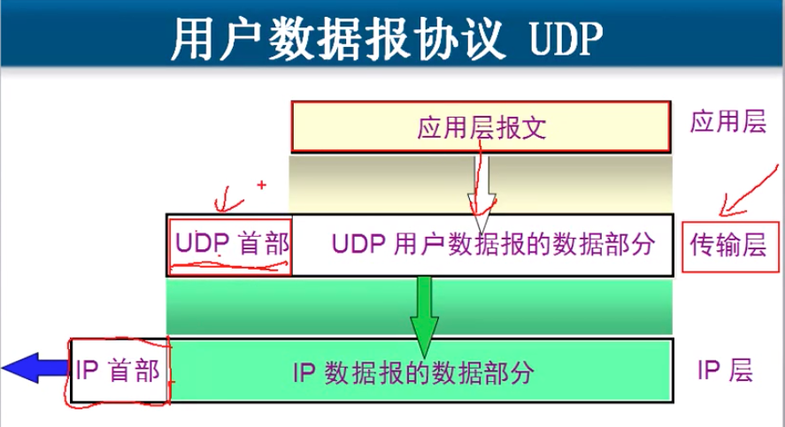
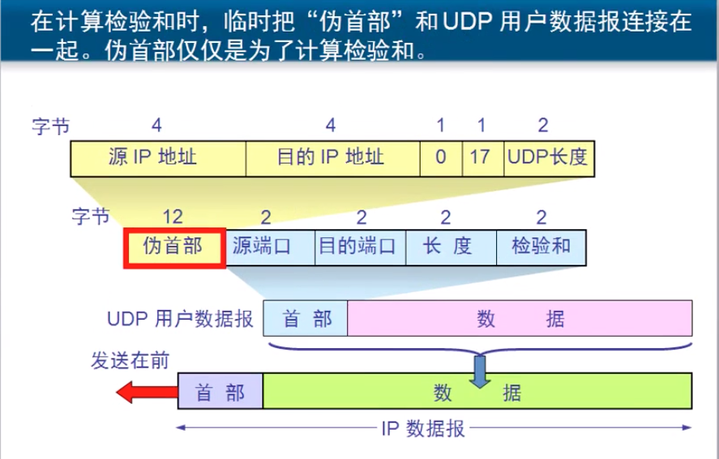
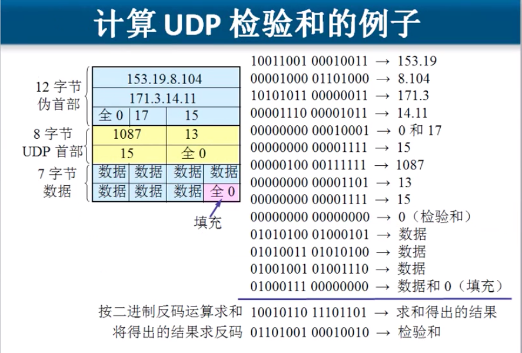
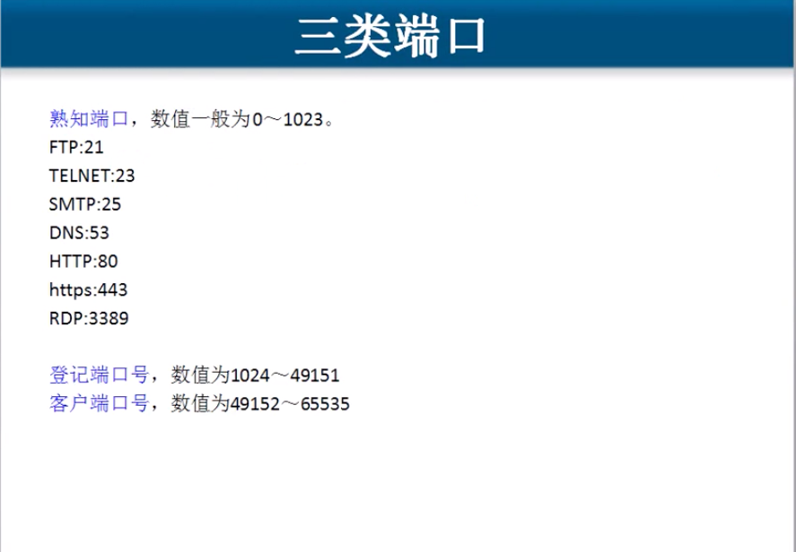
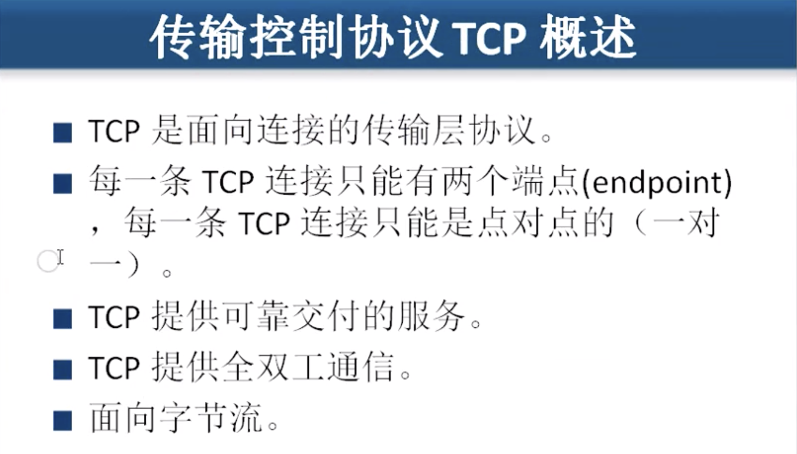

# 5.2 传输层协议UDP和TCP

## UDP和TCP协议.和应用场景.

### TCP  需要将要传输的文件分段, 传输 , 建立会话, 可靠传输, 流量控制

### UDP 一个数据包就能完成的通信, 不分段, 不需要建立会话, 不需要流量控制,  不可靠传输, 屏幕广播. 多播.

### 查看会话  $netstat   -an

### 查看建立会话的进程   $netstat    -anb

## TCP的端口

#### 端口用一个16位端口号进行标志.

#### 端口号只具有 _本地_ 意义,即端口号只是为了标志本计算机应用层中的各进程. 在因特网中不同计算机的相同端口号是没有联系的. 

## UDP 的主要特点

#### 一个数据包就能完成的通信,一般都会使用UDP.

* UDP 是无连接的, 即发送数据之前不需要建立连接
* UDP 使用最大努力交付, 既不保证可靠交付, 同时也不使用拥塞控制.
* UDP 是面向报文的. UDP没有拥塞控制, 很适合多媒体通信的要求.
* UDP 支持一对一, 一对多, 多对一和多对多的交互通信.
* UDP 的首部开销小, 只有8字节.

## 三类端口

## TCP传输控制协议

### TCP协议特点

* **TCP如何实现可靠传输**
  * \*\*\*\*
* **TCP协议如何实现流向控制**
  * \*\*\*\*
* **TCP协议如何避免网络拥塞**
  * \*\*\*\*

