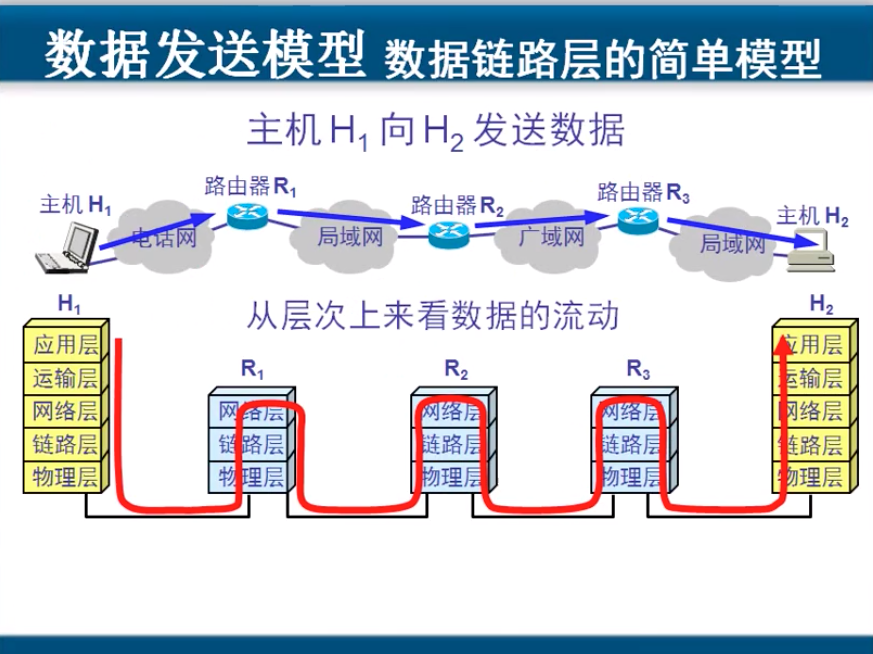
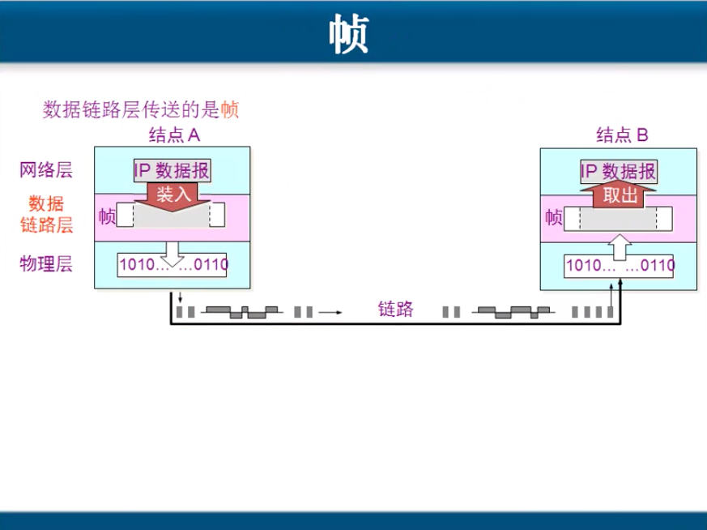
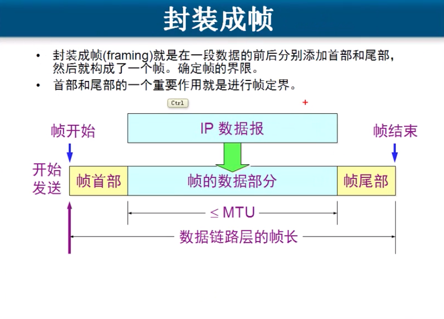
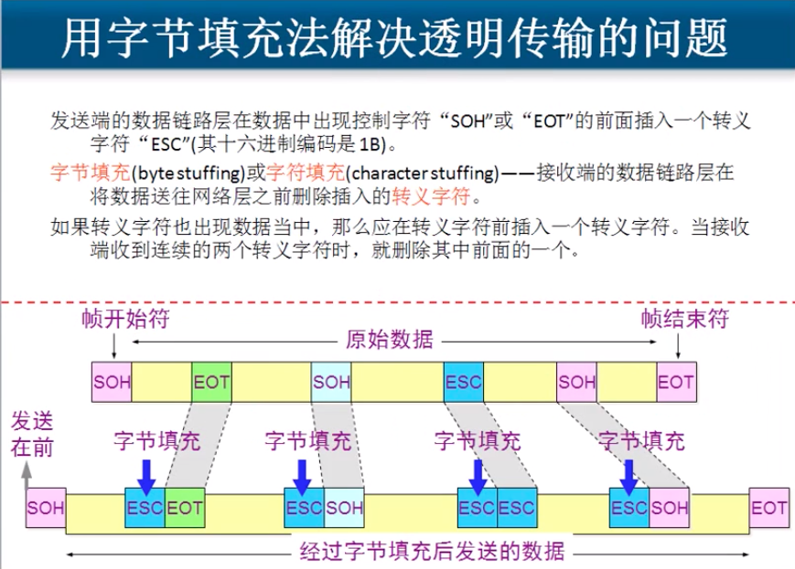
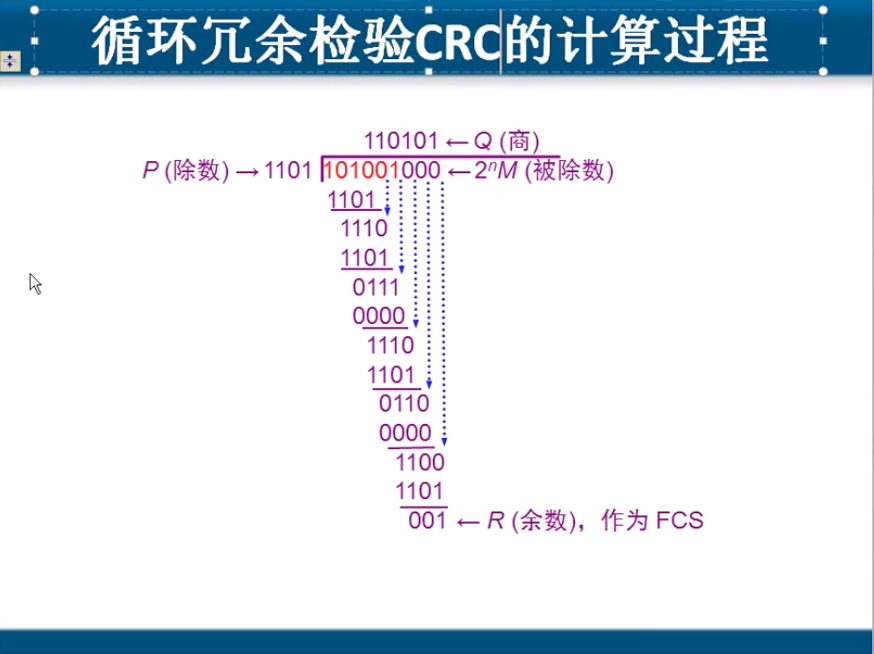
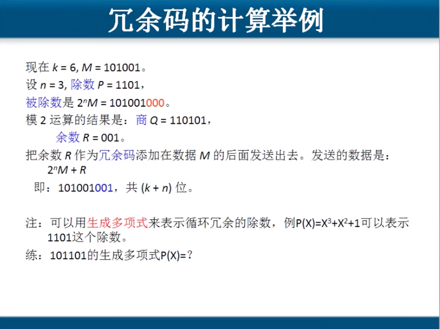
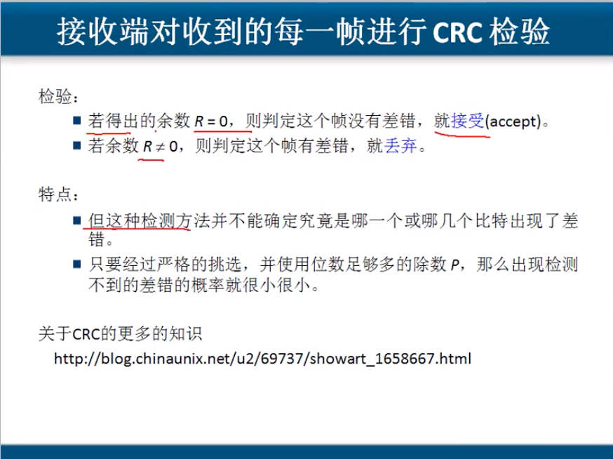

# 3.1 数据链路层基本概念及基本问题

## 基本概念

### 数据发送模型

### 数据链路层的信道类型

* **点对点信道**   这种信道使用一对一的点对点通信方式
* **广播信道**       这种信道使用一对多的广播通信方式, 因此过程比较复杂. 广播信道上连接的主机很多, 因此必须使用专门的共享信道协议来协调这些主机的数据发送.

### 

### 链路与数据链路

#### 链路\(link\) 是一条点到点的物理路段, 中间没有任何其他的交换节点.

* 一条链路只是一条通路的一个组成部分.

! 比如说两台电脑之间通过网线直接连接,中间没有任何设备, 那么这 _**根网线就称为链路**_ 

#### 数据链路\(data link\)  除了物理线路外,还必须有通信协议来控制这些数据的传输. 若把实现这些协议的硬件和软件加到链路上,就构成了数据链路.

* 现在最常用的方法是使用适配器\(即网卡\) 来实现这些协议的硬件和软件.
* 一般的适配器都包括了数据链路层和物理层这两层的功能.

! 网线一端连接到网卡上一端连接到交换机之后, 就可以说这是一根数据链路, 这个网卡有协议来控制数据的传输.

## 帧

#### 数据链路层他封装的是从网络层下来的数据. 包括数据,两个IP.

#### 数据链路层会将数据的头部添加一个帧头\(表示这是数据的开头\),在IP后面还会添加本地MAC地址和下一跳设备的MAC地址, 尾部添加一个校验值和一个帧尾.

#### 常常在两个对等的数据链路层之间画出一个数字管道, 而在这条数字管道上传输的数据单位是帧. 

## 数据链路层解决的三个基本问题

#### 1. 封装成帧

#### 2. 透明传输

#### 3. 差错控制

**数据链路层拥有差错检测功能**

**传输过程中可能会差生比特差错: 1可能会变成0, 而0也可能会变成1.** 在一段时间内,传输错误的比特占所传输比特总数的比率称为 **误码率**.  BER\( Bit Error Rate\).

#### 误码率与信噪比有很大关系

### 为了保证数据传输的可靠性,在计算机网络传输数据的时候,必须采用各种差错检测措施,\(但是不会纠错\).

