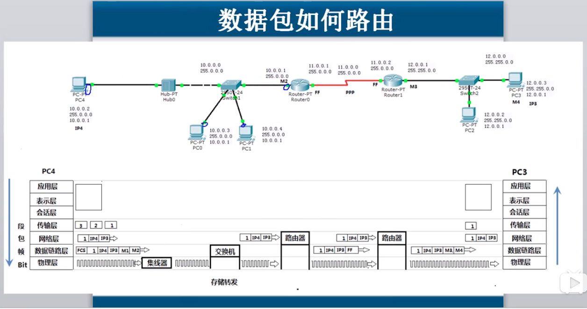

# 整体大纲笔记

## 物理层

* **物理层的主要内容: 网络设备的机械特性, 电气特性, 功能特性,过程特性**
* 数据通信的基础知识
  * **数字信号**
  * **模拟信号**
* **频分多路复用**
* **时分多路复用**

## 数据链路层 

* 解决的三个问题
  * **封装成帧**
  * **透明封装**
  * **无差错接收**
* 点到点线路的数据链路层  协议是PPP
* 广播信道的数据链路   协议CSMA/CD
* 以太网的设备有:   **集线器 , 网桥, 交换机**
* 100M, 1000M 10000M 以太网

## 网络层

* **负责在不同网络之间转发数据包, 基于数据包的IP地址转发**
* **如果数据包丢失, 那么它不负责丢失重传,也不负责顺序**

## 网络设备的OSI参考模型关系

### 发送端

1. 应用程序准备要传输的文件
2. 传输层   将文件分段  并编号
3. 网络层添加目标IP地址 和源IP地址
4. 数据链路层   两种情况
   1. 使用自己的子网掩码, 判断自己在哪个网段 \(IP和子网掩码进行与运算\)
   2. 使用自己的子网掩码  判断目标地址在哪个网段  \(也是与运算\)
   3. 如果是一个网段 arp协议广播解析目标IP地址和MAC地址
   4. 如果不是同网段  那么这个数据帧会发送给路由器\(三级设备,需要配置网关才可以使用路由器\)  , 路由器会路由表,再次进行选择, 要么扔了,要么传出去.

